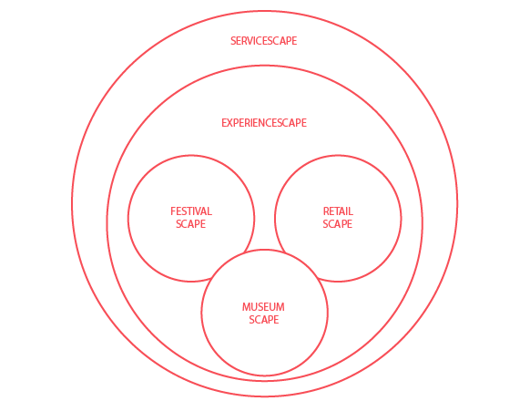

---
Pr-id: Fashion Retailscape  

P-id: Knowledge Mile series
A-id: 2  

Item-id: unique no.  

Author: Harry van Vliet, Anne Moes, Bernadette Schrandt  

Author-bio: Harry van Vliet is head of the Cross-media research group at the
Amsterdam University of Applied Sciences. 
Anne Moes, researcher at the Cross-media research group, is primarily
engaged in research on innovations in fashion retail environments and
its impact on the shopping experience for customers.
Bernadette Schrandt works as a researcher at the Cross-media research
group and has a degree in Media and Performance studies (Utrecht
University).

Abstract: In *The Fashion Retailscape* developments in (fashion) retail are
critically analysed and enriched with insights from retailers in
Amsterdam. 

Keywords: fashion, retailscape, developments, fashion, retail, stores, retailers, Amsterdam, innovation, technological development, cross-media, shopping, shops

Rights: This publication is licensed under Creative Commons
Attribution-NonCommercial-ShareAlike 4.0 International (CC-BY-NC-SA 4.0)

...

# The Fashion Retailscape

An interactive full-length mirror that allows your customers to browse
through an endless collection of clothing that you offer and see
immediately whether something fits them, including when they turn
around, and which also allows them to send a picture quickly to their
family and friends to hear what they think. This mirror is a
technological development that is already possible and which is being
introduced in fashion stores here and there.

But how probable is it that this technological innovation will become a
permanent feature of our shopping experience? How probable is it that
you as a retailer will invest in such a mirror? And does such an
innovation will save the physical store from becoming obsolete while
more and more consumers are buying online? And who is that consumer
anyway and what does he or she need?

In *The Fashion Retailscape* developments in (fashion) retail are
critically analysed and enriched with insights from retailers in
Amsterdam.

**Harry van Vliet** is head of the Cross-media research group at the
Amsterdam University of Applied Sciences. This research group examines
the impact of new (technological) developments on business innovation
and consumer experiences. As a trained psychologist he holds a PhD in
the humanities from the Utrecht University. He publishes regularly on
topics such as consumer experience, media strategy, crowdsourcing,
cross-media and business model theory.

**Anne Moes**, researcher at the Cross-media research group, is primarily
engaged in research on innovations in fashion retail environments and
its impact on the shopping experience for customers. She also teaches at
the Amsterdam Fashion Institute in ‘Fashion in Retail & Marketing’. Anne
graduated in persuasive communication (University of Amsterdam) and
wrote her master thesis on the effect of different emotions in charity
advertisements.

**Bernadette Schrandt** works as a researcher at the Cross-media research
group and has a degree in Media and Performance studies (Utrecht
University). She is specifically interested in embodied experiences: how
consumers behave in mediated environments and how their interaction with
these media creates meaningful experiences to them. Her research mainly
focuses on cultural experiences.

# The Fashion Retailscape: Innovations in Shopping
    

### Harry van Vliet
### Anne Moes
### Bernadette Schrandt

# Colophon

Harry van Vliet, Anne Moes & Bernadette Schrandt

The Fashion Retailscape: Innovations in Shopping

**Production** Rose Leighton

**Design** UNDOG, Amsterdam

**EPUB development** Gottfried Haider (PublishingLab)

**Copy-editor** The Text Company

**Printer** Offsetdrukkerij Nuance, Zaandam

**Publisher** Amsterdam Creative Industries Publishing

**Supported by** Amsterdam University of Applied Sciences (Hogeschool van
Amsterdam), PublishingLab

**Cover image** The byAMFI Statement Store in Amsterdam. Picture by Daan Verhorst

**Photography** Daan Verhorst (p. 8, 62, 68), Nom&Malc (p. 10), IntelFreePress (p. 24), Cees Wouda (p. 38), Anne Moes (p. 48)

**Contribution** The example on page 22 is a contribution of Maaike Driessen

**Contact** Amsterdam Creative Industries Publishing,
www.amsterdamcreativeindustries.com

EPUB and PDF editions of this publication are freely downloadable from
our website, www.publishinglab.nl/publications

This publication is licensed under Creative Commons
Attribution-NonCommercial-ShareAlike 4.0 International (CC-BY-NC-SA 4.0)

Amsterdam, June 2015

**ISBN** 978-94-92171-02-3 (print)

**ISBN** 978-94-92171-03-0 (epub)

# Contents

<a href="ch006.xhtml">Introduction: The Fashion Retailscape</a>

<a href="ch007.xhtml">Looking Ahead</a>

<a href="ch008.xhtml">Innovations on all Fronts</a>

<a href="ch009.xhtml">The Shopper</a>

<a href="ch010.xhtml">Cross-Media and Retail</a>

<a href="ch011.xhtml">Conclusion</a>

# Acknowledgements

***

&nbsp;

We would like to thank our fellow researchers in the cross-media
research group at the Amsterdam University of Applied Sciences and the
members of the project ‘Virtual expectations, Physical experiences’ for
their comments and encouragement. We would especially like to thank
Jochen Riester for setting up the website
[www.fashionretailfuture.com](http://www.fashionretailfuture.com) and
creating the Virtual Tour 3D app. We thank Maaike Driessen for her
contribution on fashion blogs, and Kjeld Groot, Daisy Theuvenet, Mart
Zonneveld and Wouter Meys for creating the app used in our beacon
research. Also, a sincere thank you to AMFI for the close collaboration,
students as well as lecturers, especially Sander Schellens and Marco
Mossinkoff. Finally, we would like to thank the byAMFI Statement Store and store
manager Rosiane Kuijper for giving us the opportunity to turn their
store into a ‘pop-up fieldlab’.

# Introduction: The Fashion Retailscape

***

&nbsp;

An interactive full-length mirror that allows your customers to browse
through an endless collection of clothing that you offer and see
immediately whether something fits them, including when they turn
around, and which also allows them to quickly send a picture to their
family and friends in order to hear what they think. This mirror is a
technological development that is already possible and which is being
launched in various fashion outlets. But how probable is it that this
technological innovation will become a permanent feature of our shopping
experience? How probable is it that a retailer will invest in such a
mirror? To answer this question we shall describe the expectations
regarding the developments in shopping in the next few years. We shall
then examine to what extent these developments already play a role in
shopping now, in 2015. In order to maintain clarity, we shall present a
structured overview of innovations. All of the innovations mentioned are
ultimately aimed at offering added value for the consumer, but who is
the consumer and what does he or she need? An inventory of how the
shopping consumer is viewed makes it clear that new perspectives are
required in order to do justice to the complexity of shopping behaviour
and the shopping experience. Finally, we will briefly examine specific
cross-media aspects of shopping, such as the multichannel strategy of
retail outlets and the role of the physical store in relation to the
webshop. We end by explaining how researching the developments through
the concept of servicescapes can answer a number of essential questions
on the probability of innovations more systematically.

We will enrich the developments we sketch and the arguments we use in
two ways. Firstly, examples of current innovations are given throughout
the text. Secondly, insights from interviews with Amsterdam fashion
retailers are presented at the end of each main section. In 2014,
students of the Amsterdam Fashion Institute (AMFI) interviewed retailers in Amsterdam to ask about the future of
fashion retailing. In total, 16 fashion retailers in various segments -
from small boutiques to well-known international brands - were
interviewed (they have been anonymised in this publication). During these
interviews, students were specifically interested in the usage of new
and digital strategies to engage with (potential) customers. Four main
insights and challenges for the near future were clearly highlighted by
these interviews.

# Looking Ahead

***

&nbsp;

## Shopping in 2020

The year 2020 is the new 2000. When we drew back the curtains on January
the first 2000, we discovered that the world had changed completely. For
hundreds of years we had speculated about what 2000 would look like and
all of the possibilities that modern times and, specifically, technology
would bring us. And finally we were able to see with our own eyes all of
the future scenarios around us. On the first of January in 2020 our
world will once again look different, even if it is just the way in
which we shop (Shopping2020, 2013).

The proximity of 2020 means that the predictions have a more realistic
character compared to the science fiction associated with 2000. A number
of those predictions are extrapolations of current developments that
will almost certainly unfold over the coming years, in other words
trends. Demographic developments are an example of this: an increase in
the population of the Netherlands (17.1 million by 2020), the number of
people over 50 that will be larger than the number of 20 to 49 year olds
and the increase in the number of single person households (GfK, 2013).
Although these are general trends they do have direct consequences for
the retail sector: older people have specific wishes with regard to the
delivery of goods ordered online and, because of the increase in single
person households, the home delivery of goods ordered will become a
bigger problem (Schut et al., 2014).

Over the coming years, economic developments will also occur within a
limited bandwidth. Expectations are that there will be virtually no
growth in consumer expenditure (Wolters, 2013; Erich, 2014), spending
power will stagnate or drop, more international players will join the
Dutch market, and the retail offering on the periphery will become
leaner (GfK, 2013). This not only means that consumers will primarily
base their choices on price and that they will mainly be interested in
new services that can save them money (DigitasLBi, 2014), but it also
means that investments in the retail sector will decline or only be made
by the major players in the market. And major players or retail chains
behave differently in the market compared to small independents, with
all of the consequences this entails for the development of retail as a
sector. And that is before we consider the increasing number of empty
retail premises, which is expected to increase from 6.3% to 10% by 2020
(Shopping2020, 2013).

In the predictions there are major uncertainties, for instance about the
role of ecological developments (the role of sustainability, 'green'
policies) and political developments (including privacy legislation,
rental legislation for retail premises and opening hours policy).
However, technology remains the best subject for the party game in which
we envisage the situation in the (near) future. Technology and what that
will bring us plays a recurring and leading role in all kinds of
speculation about retail developments (e.g. Hofste & Teeuw, 2012; GfK,
2013; Shopping2020, 2013; PwC, 2014; Shopping2020, 2014b). The current
star players are big data, 3D printing and wearables.

Big data is the analysis of linked databases in order to provide new
insights. The integration of (real-time) structured data (for example
payment transaction data) and unstructured data (for example, social
media sentiment about a brand) is the Holy Grail of being able to
understand patterns in the customer journey, the ability to identify
trends and new target groups and for building up a profile of each
customer so that the range of products on offer and the prices can be
adapted in real time.

Much is expected of wearables

> 3D SCANNER FOR BRA-SIZE
> 
Bra shopping; it takes a lot of time, patience and awkward moments when
the sales person wants to measure your exact bra-size. So wouldn’t it be
great if there was a solution for all this? Lincherie claims to have it!
The Dutch lingerie label Lincherie launched a new technique for
measuring the bra-size of customers in a fast and precise manner in one
of their Amsterdam stores. You no longer need staff assistance when you
want to know your exact size. How does it work? A 3D body scanner is
hidden in a mirror inside the fitting room. The mirror itself tells the
customer to spread their arms slightly and spin slowly. In less than a
minute it takes 140 measurements of the upper body. The customer then
receives her exact bra-size. Besides all of this, the mirror can also
give customers information about what’s in stock. Lincherie’s store
manager claims that this mirror makes lingerie shopping less frustrating
for women who are particularly shy .

The 3D printing trend is seen as the future disruption to the production
chain because customers can print (parts of) a product themselves
without the intervention of a manufacturer or supplier, apart from the
3D model design. The phase of 3D printing of gadgets and miniatures is
slowly coming to an end and 'normal' products are increasingly forming
part of what is available: at Shapeways.com it is possible to order a 3D
printed bikini. For fashion retail, it appears that the development of
3D scanning is a trend that is just as important. Because measurements
are different in each country and for each brand it is often difficult
for consumers to find clothes that fit properly without actually trying
them on, and all of the consequences this entails (such as returns for
online orders). A 3D scanner performs a 360-degree scan of a person’s
body, on the basis of which advice is given on the sizes of the
different brands to be chosen (for example, see
[http://www.me-ality.com](http://www.me-ality.com)).

Much is expected of wearables (Shopping2020, 2014b). There is a great
deal of press interest in wearable virtual reality (Google Cardboard,
Oculus Rift). An increasing number of major names such as Samsung and
Apple are, for instance, focusing on smart watches. Although these
examples are the most high profile, wearables also include sensors in
shoes and clothing. These sensors can be used to provide more
information about an article of clothing when held up in front of an
interactive mirror in the store or they can be given a health monitoring
function – from step counters in training shoes to sensors in clothing
that measure heart rate, blood sugar and emotions. It remains to be seen
which of these will be truly useful, for example the vibrating
'HAPIfork' that uses Bluetooth to monitor whether you are eating
healthily by recording how quickly you eat (see
[http://www.hapi.com/products-hapifork.asp](http://www.hapi.com/products-hapifork.asp)). And all that for just 100
dollars.

> STEALTH UNPOCKET
> 
The Affair, funded by Kickstarter, introduce with their new collection
'1984′ the UnPocket™' stealth technology that secures your phone,
passport and bankcards with police-grade high performance shielding to
\~100 dB. In other words: you become untrackable and unhackable.
UnPocket is a stealth pocket that securely blocks all Cellular, WiFi,
GPS and RFID signals. A whole collection of clothes is built around
these removable and water resistant pockets, so you can carry devices
with you in style. People can be tracked easily because of the GPS or
WiFi on their phone. Personal data on your contactless bank card or
e-passport can be stolen or skimmed. This can be prevented, according to
The Affair, by using UnPocket. Just pop your phone, passport and bank
cards in the pocket and you become invisible to Big Brother. The
Affair-1984 state on their website that their goal is to create:
“Fashion for an under-surveillance society. Because let’s face it, Big
Brother knows way too much already…”

All three developments are already underway, which means that this
future is already here, however hesitantly that may be in some cases.
The real question is whether they will survive the hype cycle and,
subsequently, how and when they manage to acquire a permanent presence
in the behaviour of organisations and consumers.

In addition to these three current developments, we also encounter a
number of familiar faces in the predictions about important
technological developments. One example is 'The Internet of Things', the
increasing interfacing of objects with the Internet as a result of which
'everything talks with each other' (and which also makes everything
hackable, like in the Ubisoft game *Watchdogs*). An iconic example of
that general connectivity is the refrigerator that places orders when,
for example, you are about to run out of milk. The initial performance
of these types of commercial products dates back to 1998 by the Japanese
firm V-Sync (with a Pentium II processor!). In this case it seemed that
science fiction followed the current events with an appearance by a
‘smart’ refrigerator in the film 'The 6th day', released in 2000. These
days, the smart refrigerator is the example that is cited when
underlining the fact that technology can be way off target: "Truth is,
no one wants to communicate with their fridge. No one wants the
obligation of keeping their fridge informed unless they're seriously
short on inter-personal relationships." (The Guardian, 2012).
Perhaps it is indeed not necessary at all that every object has to be
connected directly to the Internet. The possibility of uniquely
identifying an object via a barcode, QR code or through augmented
reality and thus be able to retrieve additional information via the
Internet, is probably sufficient for discovering whether we are buying a
piece of healthy meat, whether the item of clothing is cheaper elsewhere
or whether your friends enjoyed reading a certain book.

Another long-term technological development or discussion is the one
concerning Trusted Identity - the ability to establish the identity of a
person in a safe and reliable manner both online and offline. This
development is, of course, very important for payments and the new
payment methods that are being created such as via Near Field
Communication (NFC). However, it also plays a role within the framework
of, amongst other things, personalisation and loyalty programmes.
Knowing what one and the same person does online and in-store can result
in a much better personalised offering. Convenience is the name of the
game because, for example, standard information does not need to be
entered for every webshop or because multiple devices are required for
payments (cash, cash/chip card, switch card, credit card, mobile,
Bitcoin, etcetera). Behind Trusted Identity there are major discussions
taking place about technological infrastructure, security, fraud and
privacy, which also affect more legal principles such information
ownership or more moral principles, such as who ‘owns’ your DNA profile.

Knowing what one and the same person does online and in-store can result in a much better personalised offering

For example, the Dutch department store the Bijenkorf in Rotterdam has
implemented iBeacons. These small devices recognise customers when they
approach the cash register ([www.emerce.nl](http://www.emerce.nl), 2014). The staff can, among other things, see which preferences the customer has and what the
customers bought previously at the Bijenkorf. Not long after the
Bijenkorf implemented iBeacons in their store, papers started to write
about privacy issues in relation to the use of iBeacons (De Volkskrant,
2014). Does the profile that an online shop or a social media platform
builds up about me on the basis of my click pattern and purchases belong
to that company or to me?

Apart from using iBeacons to collect information about the customer, it
also can be used to send information *to* the customer. In the byAMFI
store in Amsterdam we tested the effect of sending information to
customers on their shopping experience via beacons. Every time a
customer approached a certain collection, he or she received extra
information about that collection on a mobile phone. The beacons
provided text and photographs about the designer and the concept behind
the collection. Customers who were interviewed responded partially
positively to this manner of information transfer. They said, for
example, that they think that this manner of information provision suits
not only the store, but also the future. They wished that more stores
had a system like this. One of the interviewees even said that she was
willing to pay more for the clothes now she knows more about the concept
behind the garments. Another claimed that she really liked receiving
information in this manner, because she loves to shop anonymously and
using the beacons meant that she did not have to ask the staff for extra
information. Besides these positive reactions, there was also criticism:
“You have to have time in order to use this app. If you don’t have time,
the app can be annoying”; “I prefer to decide for myself about which
garment I want to receive more information and about which garment I
don’t.” The study's overall result of the survey is that the group of
customers that shopped with the app perceived the store’s atmosphere in
a significantly more negative manner than the group that shopped without
the app. Also, customers who used the app where significantly less
willing to recommend the store to others than customers who did not use
the app. Despite some of the positive reactions of customers, there were
no positive effects of beacons found in this study (Moes & Van Vliet, 2015). A clear indication that technological innovations do not
necessarily lead to a more positive shopping experience.

> MEET ALEX & ANI WITH iBEACON
> 
Everybody is talking about it: iBeacon. As with most new technologies,
fashion retailers are not sure whether to invest in it or not. Alex &
Ani, an American fashion retailer focusing on authentic jewellery, gave
it a try. The main goal for Alex & Ani to use iBeacon was to get
consumers into the store who are not familiar with the brand – something
many brands strive for. Additionally, it is expected that the software
will create a rich profile of shoppers’ browsing and purchasing
behaviour. Gender-specific information combined with time and location
spent in-store plus purchase preferences should give Alex & Ani more
insight into the behaviour and wishes of their (future) customers. 

> Alex & Ani ([www.alexandani.com/our-story](http://www.alexandani.com/our-story)) is the first companyin the US to start working with iBeacon nationwide
(Swirl, 2014).
Their aim is to make people who do not know Alex & Ani yet more aware of
their existence. However, before rolling out, the company did some tests
from May to July 2013 in order to determine the success rate of the
technology. They found that over 75% of shoppers read Alex & Ani’s
offerings and half of these shoppers redeemed the promotion (20%
discount on a bracelet). Although actual sales conversion rates are not
known, Alex & Ani therefore seem to be enthusiastic about the
possibilities of iBeacon for their company.

## Knowing Your Customer in 2020

A common way of still being able to obtain a clear picture of
(uncertain) future developments is to draft scenarios. A very common
form of this is to take a development with an uncertain direction, for
example, how people will deal with their possessions in the future. Two
extremes are then formulated, for example, 'buying will continue as
usual' or 'there will be an economy based on bartering and sharing'.
When this is done for two developments these axes can be intersected in
a coordinate system, which produces four possibilities that can be
further defined. Here we describe two of these types of scenarios for
the retail sector: one focuses on retail in general, and one focuses on
fashion shopping patterns facilitated by technology.

The 'Business Models of the Future’ report (Shopping2020, 2014a) states
two uncertainties:

1.  Do consumers act on the basis of a) individual interest – are they focused on control and not willing to share, or b) collective interest – are they focused on sharing and teamwork?

2.  Are consumers looking for a) the lowest price or b) are they willing to pay more for extra added value such as convenience, luxury and sustainability?

Figure 1: Future shopping scenarios

Four scenarios emerge when we intersect these two uncertainties (Figure
1). The first scenario, a thriving collaborative economy is about
consumers having access to services and products that they wish to use,
which they do not necessarily have to own, but which they can hire and
use on a temporary basis. This can be for reasons of convenience or
because of sustainability considerations. In the price-conscious
collaborative economy (scenario number 2) the power of the collective is
used to negotiate good deals through collective purchasing and
agreements relating to, for example, energy and insurance. Products,
such as cars, are also shared because it is less expensive to do it that
way. Objects are also shared between people because this makes good
economic sense (see <https://peerby.com>). In the third scenario,
price-conscious self-society, the main aim for the individual consumer
is to find the best deal, and it makes no difference whether it is a
different supplier or a different brand each time. Online marketplaces
are consulted in order to find that best deal (see
[http://www.beslist.nl](http://www.beslist.nl)). The lowest
price is what counts, much more than convenience and sustainability. In
the last scenario, the thriving self-society, the individual consumer is
looking for convenience, luxury and experience, for which he or she is
willing to pay. Online marketplaces are used to find unique products and
services. This type of consumer is happy to be advised and often takes
out a subscription in order to be able to continue to enjoy the
experience (see [http://www.winecast.com](http://www.winecast.com)).

Hofste & Teeuw (2012) also present four scenarios; however, these are
more closely tailored to the consumer and how he or she shops. As a
consequence, these scenarios are less abstract compared to the scenarios
discussed above. This is a direct consequence of the uncertainties that
were chosen:

1.  Does the consumer act on the basis of a) purchasing a product or service, or b) focusing on the experience?

2.  Does the current shopping process change or not under the influence of, for example, the mobile phone?

Both axes are, in fact, not chosen very well. The first axis does not so
much describe an uncertainty but two different ‘consumers’ (see
discussion below). For the second axis, the outcome was already known at
the time of publication in 2012: yes, the shopping process is changed
even just by using a smartphone in the shop (to compare prices), or for
advance online orientation (comparison sites). This is, therefore, far
from being an uncertainty, already a reality (in 2012).

Four more possible scenarios can also be generated on the basis of these
two axes (Figure 1). In the first scenario, the 'Augmented Shopping
experience', the consumer’s experience is central. The store makes
optimum use of virtual techniques in order to show how the personally
selected clothing suits you. Interactive full-length mirrors, 3D models
and virtual catwalks intensify the experience. In the 'Personal shop
experience' scenario the consumer buys as he currently does, but the
store is enriched with extra experience moments through smell, sound and
visual stimulants matched to personal aspirations. For 'Virtual
shopping', technology is used to enable the consumer to make a selection
from a large range by creating a virtual fitting room and the ability to
show the choice immediately to friends via a Tweet mirror. In the last
scenario, that of the 'Social shopper', social media play an important
role in the buying process, both online and offline. Review sites and
the opinions of family and friends are consulted in order to decide what
to buy. Brands and shops monitor this and try to influence it and to
learn from their customers by analysing thoughts and statements.

## Online in the Past, Present and Future

It is undeniable that online developments are playing a major role in
the future scenarios that have been outlined. What have those
developments been and what are the future prospects?

Weltevreden (2012) identified four phases in the evolution of online
shopping. In the first phase, between 1994 and 1999 only 16% of people
in the Netherlands had access to the Internet at home. In this period,
the vast majority of the activities consisted of surfing the net and
using e-mail. Retail chains and mail order firms in particular had
websites, although only 4% also used the website as a sales channel. The
website during this period was mainly used as a referral to the store
(opening times, location). There was virtually no online shopping: in
1998, only 2% of the Dutch population bought via the Internet. By 2003,
this had already risen to 31% due to a substantial growth in the number
of households that became connected to the Internet between 1999 and
2003: around 68%, of which one-third was already using a broadband
connection. By this time, an increasing number of retail chains and
independent retailers had a website, which was used to provide more
information about products and services and for e-mailing newsletters to
keep customers informed and to build loyalty.

In the period between 2004 and 2009, the number of households with
access to the Internet had increased even further to 91% and webshops
and social media were becoming popular. By 2009 more than two-thirds of
the Dutch population were shopping online, and the amount of spending
online and the average amount spent was increasing substantially. This
period showed the mass emergence of (smaller) web-only firms, which
resulted in a threefold increase in online sales. However, the
traditional retail sector lagged behind when it came to developing
webshops: only 18% of the retail chains and only 6% of the independent
retailers had a webshop in 2006.

> 3D SHOPPING FROM HOME
> 
Want the total in-store experience without having the trouble of
traveling to the store and having to deal with crowds? In 2012, Keytree
developed an interactive system that enables users to shop virtually in
their living room. By developing what is known as an ‘immersive’ 3D
environment, users can walk virtually through the supermarket and order
their items. In this way, shoppers do have the experience of being in a
store, but don’t have to actually go there and queue up to get their
products. Keytree works with Kinect technology, thereby making it
possible to navigate through the environment without using a mouse or
PC. Rather, your body becomes the console. The store data is provided by
Tesco, Amazon and eBay and by tracking the personal behaviour of both
the individual and the total amount of shoppers, and personalisation is
offered by both the individual preferences and suggestions based on what
others bought.

In the final phase, between 2009 and 2012, virtually every Dutch person
was connected to the Internet, where a shift could be detected towards
the use of the laptop and the smartphone as the preferred device, rather
than the desktop. In 2012, three-quarters of the Dutch population
shopped online and although the number of orders placed and the amount
of the spending were still increasing, the rate of growth was levelling
off. The number of webshops operated by retail chains and independent
retailers was increasing. However, retailers with a physical store still
remained in the majority (61% in 2011) compared to 17% web-only firms in
the retail sector. By 2011, around 22% of retailers had both a physical
store and a webshop.

The impact of online sales on physical
shops was substantial

Weltevreden (2012) concludes that the impact of online sales on physical
shops was substantial, in addition to factors such as the economic
crisis, increased rents for physical stores, opening time legislation
and suchlike: "In sectors in which (parts of) the product or the service
can be digitised, such as financial products (digital policies),
holidays and travel (e-tickets), photograph/film (digital photographs)
and media goods (music, films), the number of stores has declined
considerably in the last decade. Telecom is the only exception; in this
sector the number of stores has increased substantially, which is in
part due to the growth in demand for mobile Internet devices." (p. 20).
Conversely, it applies that "Especially in (…) sectors that are
interesting for recreational shopping, such as clothing, shoes, personal
care and sports products, there is an increase in the number of stores"
(p. 20).

We can extrapolate the historical development outlined by Weltevreden to
the present day and to the future and can do so on the basis of the
results of the Shopping2020 research programme. This research programme
asked how consumers would be shopping in 2020. This question has become
relevant and urgent in the context of the current economic crisis and
developments such as changing consumer behaviour, changes in the value
chain, the emergence of new technology, the digitising of products and
profound (international) competition.

The Shopping2020 study reveals that in 2012, of the total consumer
spending[^1] 17% was online, and 83% was in physical stores.[^2] This
spending represents an online turnover of 11 billion Euros out of a
total of 65.9 billion Euros. The product categories that have the
largest share in this are insurance, travel and ticket sales (flight
ticket, accommodation). Of the 11 billion Euros of online sales, 4.8
billion Euros were generated in the retail sector. Fifty per cent of
that 4.8 billion Euros is shared between ten sellers: RFS Holding
(Wehkamp, Fonq, Create2fit), Bol, Zalando,
Albert.nl, BAS group (Dixons, MyCom, Dynabyte),
Coolblue, KPN, H&M, Hema and Ticketmaster Nederland. If you then look at
fashion retail, it represents approximately 10% of total online sales:
0.9 billion Euros for clothing and 0.3 billion Euros for shoes and
personal lifestyle (Shopping2020, 2013; Wolters, 2013; Schut et al.,
2014).

It is expected that the online share will increase substantially over
the coming years. The forecast growth to 2020 does, however, depend on
who one asks. According to consumers, the online share will increase
from 17% to 50%, but according to experts the share will only increase
to 36% (Wolters, 2013).[^3] The expectations differ considerably for
each product category. The biggest growth is expected in the product
categories that were already doing well online in 2012: event tickets,
package holidays, individual flight tickets and accommodation and
insurance are expected to increase from the current 50% to between 70%
and 80% of the share of online sales. For fashion, according to the
experts, the current share of 10% of online sales will increase to 27%
for both clothing and shoes & personal lifestyle (Wolters, 2013). An
estimate that can also be found in a recent ING report on shopping
domains (Erich, 2014). The same pattern, but with different figures, can
be seen when consumers are asked about the products that they will no
longer be buying in a physical store in 2020. The top of that particular
list has the same product categories stated by the experts: event
tickets, package holidays, individual flight tickets and accommodation
and insurance. Around 40% of consumers say that they will no longer be
going to physical stores for these products. For fashion, the number is
considerably lower: 17% (shoes and personal lifestyle) and 12%
(clothing) (Peters & Witte, 2013).[^4] We shall return to the potential
reasons for this when we discuss the role of the physical store.

Besides online shopping, there is another interesting development
happening in the world of online fashion. Fashion apps and fashion blogs
are becoming more and more popular. Fashion apps are applications that
offer a shopping and/or inspirational platform for the app user. Like
other apps, these can be downloaded onto smartphones from an app store
(Magrath & McCormink, 2013). These days, fashion blogs function as a
central platform where fashion-related news and information circulates
(Rocamora, 2012). Fashion blogs can inspire their readers.
Advertisements that are ‘hidden’ in the blogs can affect consumer’s
(brand) attitude and shopping behaviour. These blogs have the ability to
create a strong personal relationship with their readers. Advertisements
viewed in such a personal and non-intrusive context can influence
consumers in a more subtle way than traditional media can (Halvorsen et
al., 2013).

> FASHION BLOGS: AUTHENTICITY IS FOR SALE
> 
Last year, Yara Michels wrote an article in her blog This Chick’s Got
Style about her ninth ear piercing. She also told her readers where she
bought her other eight piercings, among which was a particular shop in
Amsterdam. A few days later Yara received an e-mail from this particular
jewellery maker: a lot of people showed up to her store and everybody
showed Yara’s picture, they all wanted to have the same earring.
> 
This is an example of how fashion blogs influence the shopping behaviour
of consumers. Because of their influence, fashion blogs can function as
a marketing communication tool for retailers. A recent study by Maaike
Driessen revealed some interesting results. A survey answered by 108
fashion blog readers, showed that fashion blogs influence the shopping
behaviour of consumers. Apparently, 93 percent of fashion blog readers
bought something after they saw it in a fashion blog. Besides this, the
results show that fashion blog readers are influenced by product reviews
and they are more likely to buy something after they have seen it in a
fashion blog.
> 
In interviews with the bloggers, they said that they started blogging because
they wanted to do something beside their study, they wanted to share
their style or were bored. Fashion bloggers are becoming marketing tools
since they work together with retailers and are paid for writing
articles. None of the fashion bloggers spoken to dreamed of getting paid
for what they loved to do. A lot of them do now, and all fashion
bloggers are happy to work with retailers. But bloggers have a few terms
and conditions. First, the retailer should suit their style and second
they like to get something in return.
> 
Retailers are also eager to work with fashion bloggers but the research
shows they do not really know how to use fashion bloggers for their
marketing strategy. The
website [www.blogmakelaar.nl](http://www.blogmakelaar.nl) was created as
a result of this research. This website allows retailers to get to know
more about fashion bloggers as a marketing communication tool.

## The Future in 2015

What is missing among all of these (extrapolated) numbers is a more
qualitative picture of the changes that will take place: What will the
innovations be that will ensure that more is sold online or that
consumers still go to stores? It is true that all of the Shopping2020
reports are interspersed with examples of innovations, from a more
science fiction type character (the 'Sight'-video on
<http://vimeo.com/46304267>) to the constantly recurring Google Glass
type innovations. However, the examples are used for illustrative
purposes only. There is no systematic inventory of the changes currently
taking place in the retail sector, and that can be regarded as being the
forerunners of what will become reality by 2020.[^5] The scenarios
outlined earlier have such a system within them, but, what is more, the
future perspectives outlined are often abstract (Shopping2020, 2014a) or
have a limited view, such as a technological view (Hofste & Teeuw,
2012). The choice of a limited number of uncertainties when developing
scenarios also means a full description of all innovations can never be
given.

There is no systematic inventory of the changes currently
taking place in the retail sector

In September 2013, the Cross-media research group of the Amsterdam
University of Applied Sciences (AUAS) in collaboration with the
Amsterdam Fashion Institute (AMFI) started a study on innovations in
fashion retail on the basis of two fundamental principles. The first
fundamental principle concerns the method of classifying all occurrences
observed, for which a mix of a taxonomy and a typology was chosen. A
taxonomy is a systematic classification of aspects based on
observations. By observing multiple occurrences, many of their aspects
can be classified into similarities and differences. The result is often
a hierarchical classification, such as the taxonomy of species in flora
and fauna. Whilst a taxonomy starts on the basis of observed
occurrences, a typology starts on the basis of a concept. The
distinctive properties that potential occurrences could normally possess
are devised and the actual occurrences are then classified in accordance
with these rules. We then talk about 'types’ as opposed to 'kinds’, as
in the case of a taxonomy. One can say that taxonomies are created
empirically or inductively and that typologies are created conceptually
or by deduction. In order to make an inventory of the innovations in
fashion retail we have opted to work at the highest level using
conceptual classification (typology) and then to use two levels 'below'
that have resulted in ‘kinds’ of innovations on the basis of
observations (taxonomy). The decision to work at the highest level using
a typology arises from the framework that has been developed for
examining new services by the cross-media research group (see Van Vliet,
2014).

The second fundamental principle concerns the typology to be used for
the innovations. We have opted for the STOF model as it is a
well-founded framework in business model innovation research. The STOF
model is part of the STOF methodology, a design method for business
models. The STOF model describes business models on the basis of four
associated domains: the Service domain (the added value of the service),
the Technology domain (the technical functionality and architecture
required in the service), the Organisation domain (the network of
parties involved and the processes for delivering the service) and the
Financial domain (the method of income generation and the sharing of
risks, investments and income amongst the various actors in the
network). It is from these four domains that the methodology derives its
name (Haaker, 2012).

For the time being, these fundamental principles have resulted in the
following classifications for the innovations that have been found
(Table 1). The actual inventory of innovations in fashion retail is
published on the website
[www.fashionretailfuture.com](http://www.fashionretailfuture.com). The
regularly updated inventory on the website can be viewed as 'data' that
can be part of future research. In the next section we shall examine the
four innovation domains in more detail, give a few examples and describe
a particular development for each domain in more detail.

Service Domain | Technological Domain | Organisational Domain | Financial Domain
---  | --- | --- | ---
**Personalisation** | **In-Store** | **Collaboration** | **Payments**
Customer Cards | Interactive mirrors | Outlet platforms | Alternatives
Personalised products | Shopping walls | Affiliates | Coupons
**Experiences** | Interactive shop windows | **Logistics** | **Crowd funding**
The shop as an event | Customer tracking | Smart integrated inventory | **C2C**
Atmospherics | 3D body scans | Smart inventory management | &nbsp;
Playful experiences | Smart hangers | Click & Collect | &nbsp;
Social experiences | Touchscreens | Stockless store | &nbsp;
**Crowdsourcing** | Smart Garments | Pop up store | &nbsp;
Designed by customers | **Online** | **Value Chain** | &nbsp;
Co-creation | 3D shopping | Fast fashion | &nbsp;
&nbsp; | Virtual mirrors | Reverse supply chain | &nbsp;
&nbsp; | 3D fitting | &nbsp; | &nbsp;
&nbsp; | **Mobile** | &nbsp; | &nbsp;
&nbsp; | Scanning | &nbsp; | &nbsp;
&nbsp; | Holographic and augmented reality | &nbsp; | &nbsp;
&nbsp; | LBS/Routing | &nbsp; | &nbsp;
&nbsp; | **Public Space** | &nbsp; | &nbsp;
&nbsp; | Shopping walls | &nbsp; | &nbsp;
&nbsp; | Public screens | &nbsp; | &nbsp;

Table 1: Classification of innovations in fashion retail

## Insights and Challenges Amsterdam Fashion Retailers: Online Presence

Most of the retailers that were interviewed by AMFI students have a – still simple – webshop. Some because they want to make sure that they have an online presence,
while others really see it as a way of increasing sales. However, most
retailers struggle with how to handle this effectively: making sure that
people find your website and are seduced to buy your products on it.
Retailer T: “Recently, I asked two boys, with no knowledge of what I was
doing, to buy a pair of jeans from our webshop. And after doing so, they
said that it was unclear to them whether or not they could actually buy
a pair of jeans on our website. So for them, it was a website, not a
web*shop*. This really triggered me; it is so easy to become blind in
this business. So I drastically lowered the amount of clicks to get to
the point of purchase and gave more information about our terms in
relation to online sales. Hopefully, it has now become more clear that
we also run a webshop” (personal
conversation, 2014).

Looking at the future of fashion stores, retailer T has only one thing
to say: “It will all be about online and digitalisation, like, marketing
wise. The paper era is blowing its last breath. [...] I mean, this is
relevant to all retailers. In the end, you want to remain profitable.
Paper advertising is a tradition of ours, but it is hard to tell
conversion rates. If I buy 100,000 books to sell in my store, I do want
to make sure that enough customers will buy them” (idem). He therefore pays a lot of attention to his website
and SEO optimisation. Adding the right text, and the right links. “My
goal is to appear in the top ranking in Google within one month. So if
we have a new collection, I make sure that I announce it well, that
everybody knows about it when searching for it. This is where the main
part of the marketing budget goes to” (idem). Other retailers confirm
this challenge: if people look for certain brands or fashion items, they
want to make sure they are found quickly. But how to do that, remains a
big task, especially when marketing budgets are limited.

# Innovations on all Fronts

***

&nbsp;

## Service Innovations

The service domain concerns the added value that a service or product
provides for the customer. A great deal is expected of personalisation,
in other words, the customising of the service or product for a
particular individual so that a more or less unique service or product
is created. The most literal interpretation of this is tailor-made
clothes and the independent creation of, for example, a Louis Vuitton
bespoke handbag from The Haute Maroquinerie in Bond Street in London.
Personalisation is not just about creating a unique product or service;
it also relates to finding an appropriate or unique product or service
for an individual. Recommendations for you, the customer, based on your
previous purchases or based on preferences of people with similar tastes
can be found in many webshops. Another example is
[Buyosphere](https://twitter.com/buyosphere) where you can obtain personal
fashion advice from other visitors. Personalisation is also about
customising the information about the service or product by taking into
account the specific moment (morning rush hour, Wednesday afternoon,
during Sunday opening hours, et cetera) and the precise location
(in-store, en route, at home, et cetera). This personalisation can be
improved by gathering as much information as possible about the
customer: from buying trends via store cards and online click and buy
patterns on PC, tablet, Smartphone and Smart-TV to personal information
(zip code, e-mail address) and all kinds of sensor information (how you
move around the store, what you look at, what products you pick up or
take to the fitting room, et cetera). This combination of data can then
be used to persuade the customer with targeted special offers or by
adapting advertisements on TV, online, in magazines or on billboards in
real time, as depicted in a scene in the film *Minority Report* released
in 2002.

> FASHION ADVICE @BUYOSPHERE
> 
Buyosphere was a fashion advice community where one could browse style
guides that were created by members of the community or simply ask
advice on where to find something that is exactly what the consumer was
looking for. Born out of personal frustration with finding unique
products online, Buyosphere focused on finding that exclusive item that
consumers couldn’t seem to find using traditional methods. As Buyosphere
said : “Our goal is to create the best and most unique content through
user curation – unearthing unique designers and products you won’t find
through a traditional search.” With Buyosphere, shoppers could sign up
for the Fashion Advice Community that enabled users to 1) ask questions
to get help in finding that perfect item, 2) check style guides of other
members and 3) save those items that customers love to their personal
profile, thereby also having the ability to share these items with their
personal network. Becoming an editor – an active member who is, for
instance, able to create style guides that can function as an
inspiration to others – was also one of the options Buyosphere offered.
In this role, one could (as already mentioned) create style guides, be
featured on the homepage and in newsletters and get a special profile
where one could build a personal fashion magazine and style portfolio.
The failure of Buyosphere proves that not all new interactive
communities are a guarantee for success.
> 
After existing for two years, Buyosphere pulled the plug in 2014. As
they said: “It was a million things that led to this not turning out the
way we wanted it to.”

Consumers do not wish to be identified when entering a store in order to be presented with a personal shopping experience

However, research shows that only 14% of consumers want a personalised
offering, 42% do not and 44% are undecided (Peters & Witte, 2013). Of
consumers, 77% also say that they do not wish to be identified when
entering a store in order to be presented with a personal shopping
experience. One possible explanation for this is fear amongst consumers
about what happens with their data. Of those questioned, 67% were
willing to share information with the retailer in order to be presented
with relevant offerings but did not want their details to be shared with
other parties. That makes it difficult to create an overall profile of a
person and personalisation therefore remains restricted to a brand,
store, social media platform, app or webshop despite the fact that
benefits are to be had, including for the customer, by making
information available to other suppliers about a person’s preferences.
Musical preference (iTunes downloads, Spotify playlists, radio listening
pattern) is, for example, not an isolated feature of an individual but
is related to all kinds of preferences. The North & Hargreaves (2007)
study shows that musical preference is associated with choices of
particular newspapers, radio stations, TV channels, TV programmes,
magazines, books, the amount of time spent reading and the preference
for certain leisure activities. In that sense music preference says
something about a person’s lifestyle. It is not unimaginable that a
fashion webshop can recommend something relevant to a customer based on
that customer’s music preference.

A theme that is just as important as personalisation is the provision of
*experiences*. Piet Zoomers said in an interview: "Those that want to
survive in the future will have to pay a great deal of attention to the
in-store experience, certainly if one wishes to take on online
shopping." (in Hofste & Teeuw, 2012, p. 6). Veenstra (2012) regards
'experience' as an important weapon in combating inner-city property
vacancy. Williams (2014) sees Disney's "Merchantainment' strategy as the
next phase of e-commerce: the retail-store strategy of offering
environments where consumers want to spend time - and money (p. 114).
Ter Haar (2014) talks about the 'total retail experience'. And in the
PwC trend report (2014) the (digitising of the) *shopper experience* is
referred to as a megatrend: "A digital experience of products and
services is achieved by creating a clear experience of his product
and/or formula, in which online and offline are integrated. This digital
experience is achieved by using and combining technological developments
such as mobile devices, augmented reality, video wall holograms." (p.
12). What is striking is that new technology is often regarded as the
bringer of good news: an experience is created ‘automatically’ through
holograms, augmented reality, video walls, digital fitting rooms and
virtual shopping.[^6] Examples are the Burberry store with large screens
and magic mirrors (that respond to RFID tags in clothing), interactive
Coca Cola floors in shops and apps that allow you to shop 'socially'
because you and your friends can all go shopping at the same time using
social media ([www.bevyup.com](http://www.bevyup.com)). Still, all too
often experience is seen as a key to success without stating precisely
what constitutes that experience.

The fact that there are other views about experience and shopping apart
from the purely technological aspect can be found in the study
undertaken by Erdman (2008). He tried to devise a number of design
principles for adding experience to shopping areas so that their
distinctive capacity would increase. He based this on, amongst other
things, the well-known Pine & Gilmore theory on the Experience Economy
(Pine & Gilmore, 1999). In that theory, Pine & Gilmore derive a number
of design principles for creating experiences. In his study, Erdman
examined the extent to which these could be used in the context of
shopping areas and in so doing allowed himself to be guided by 12
experts. In the end, he devised four principles. Their strength is that
he attempted to translate them into specific instructions:[^7]

1.  Achieve harmony, in other words harmonise all variables within a shopping area with each other. For example, appropriate for the environment, logical routing, correct size and scale in the shopping area, correct retail choice (sectoring, price, quality), quantity and quality of catering.

2.  Avoid negative impressions that can affect the experience such as dirty and unsafe environments, poor accessibility, high parking charges, unoccupied property, wind nuisance, etcetera.

3.  Activate the senses to create stimuli that feed the experience: light, smell, sounds, climate control, sight lines and visual aspects.

4.  Create an identity by paying attention to recognisability (landmark, logo, promotion) and by creating a safe and pleasant atmosphere.

One final remark on experiences is necessary. In Van Vliet (2012) it is
already stated, as a result of reviewing the Pine & Gilmore theory, that
strong doubts can be raised about the unilinear process of economic
evolution advocated by Pine & Gilmore, in which 'experiences' are a
fourth step in the escape from the 'commodity trap'. The few historical
examples that were referred to in Van Vliet’s study (2012) as
counter-example can now be supplemented further by examples from the
retail context. In the 1930s, Carl W. Dipman described a number of
future visions on the development of food retail, in which recurring
aspects are self-service and "shopping is to be an *experience*, not
just a job to be done" (in Bowlby, 1997, p. 99). Furthermore: "In the late eighteenth century Oxford Street
had already been described as a 'dazzling spectacle' of 'splendidly lit
shop fronts' and 'alluring' and 'handsome' displays." (Nava, 1997, p.
64). Even more important than a vision and an illustrative example is
that particular experiences were 'produced' and perceived around the
turn of the 19th to the 20th century, the most iconic example of these
being department stores. Department stores were more than just a place
for doing your shopping; they formed a new public venue for displaying
modernity and were visited as tourist attractions. The Selfridges
department store was regarded, like Westminster Abbey and other places,
as one of the biggest attractions in London. One of the Selfridges
advertising slogans was: "Shopping at Selfridge's: A Pleasure - A
Pastime - A Recreation". Department stores were 'fantasy palaces',
luxuriously built from marble, iron ornaments, large open staircases,
parquet flooring and silk and leather furniture. They were the first
public places that used electric lighting, and not just for illuminating
but also for the theatrical effects. Everything was configured for
service and having fun whilst shopping, supported by unique spaces for
children, restaurants, roof terraces, zoological gardens, ice-skating
rinks, libraries, galleries, travel agencies, banks and all manner of
services for delivering your purchases to your home. And that wasn’t
everything: "In their display of goods and use of colour, they often
drew on the convention of theatre and exhibitions, continually
innovating in order to produce new, vivid and seductive environments,
with *mise-en-scenes* which combined, or offered in sequence, modernist,
traditional and exotic decors (…) These magnificent stage sets also
served as a backdrop to live entertainment, which was provided on a
regular basis. There were live orchestras in the restaurants and tea
rooms and even, occasionally, in the grocery departments. Dress shows
and pageants were regular events. 'Spectacular oriental extravaganzas',
which included live tableaux of Turkish harems, Cairo markets or Hindu
temples, with live performers, dance, music and of course oriental
products, were also held frequently." (Nava, 1997, pp. 66-67; also see
Stobart, 2008).

## Technological Innovations

The technology domain in the STOF model concerns the technology that is
required to produce a new product or deliver a new service. A multitude
of examples can be found in this domain, in which the development has
already gone beyond QR codes, iPads, narrowcasting and information
kiosks (Molenaar, 2011). Actual shop experiments are being undertaken
with interactive full-length mirrors, from the 'simple' form where more
information about the item of clothing is displayed on the basis of an
RFID chip in the item of clothing (*magic mirror*) or where a picture is
taken of the clothing that you are trying on and you have the
possibility to share it via social media (*tweet mirror*), to
gesture-based browsing through a collection where a selected item of
clothing is projected on top of your image in the mirror and you can
also move to see whether it ‘fits’ (*virtual mirror, Kinect-shopping*).
There are plenty of examples of in-store touch-screens: from iPads to
large video walls, which can be used by the staff or the consumer to
search, select and order. Screens also appear increasingly in store
windows (*interactive storefronts*), making it possible to search and
order at the physical location of the store when it is closed. This is
not necessarily linked to the store as such. Examples can also be found
of self-service digital stores in public spaces such as airports (an
example of which is Tesco at London Gatwick Airport) and in metro
stations – the next generation of vending machines. Or the technology is
in the clothing (tags) or on the clothes hangers – showing the number of
‘likes’ for the item on social media. Technology is not always visible
to the customer, there is increasingly more in-store technology
(sensors, cameras, WiFi-tracking, iBeacons) for monitoring customer
patterns such as the route taken and items of clothing picked up, to
cameras in mannequins that follow the eye movements of the customers.

> USE THE TWEET MIRROR WHILE SHOPPING
> 
At the ‘Honeymoon shop’ bridal shop in Rotterdam, they have an in-store
Twitter Mirror. This smart mirror can take pictures that shoppers can
email, tweet or post to whomever they want. With this new technology, it
is perhaps a little less difficult for the brides to choose the dress of
their dreams. The bridal shop’s main goal is to help the customer to
make a carefully considered choice about her wedding dress. One can use
the Tweet Mirror by simply standing in front of it. You can use the
virtual buttons on the screen to take and save pictures. This allows
customers to see all of the dresses that they tried on and compare them
with each other, without having to try them on again.

Technological innovations can also be found online. There are various
examples of online *virtual mirrors* (*online fitting rooms*) as
counterparts to in-store interactive full-length mirrors, where the
image of the person filmed using a webcam is used for the virtual
‘fitting’ of all kinds of goods, from glasses, wigs, jewellery to
make-up. Complete 3D shops can also be found online in which you can walk
through the shop like 'in real life’ and do your shopping. These can
also be personalised so that you do not have to spend an endless amount
of time looking for that one particular product. Because sizes are a
significant bottleneck when ordering clothing online, online solutions
for this have been developed that allow you to have a model of yourself
produced and have that model try on the clothes
([http://corpo.myvirtualmodel.com/index.html](http://corpo.myvirtualmodel.com/index.html))
or upload photographs of yourself and your sizes so that a 3D model of
you can be produced, for example *Tesco's 3D fitting room*.

> 3D FITTING @TESCO
> 
In 2012, Tesco launched a web-application that enabled consumers to
create a 3D-photo-realistic model by entering body measurements and
uploading two photos. Users of the Tesco feature were invited to upload
a photo of their face to create the face of the virtual model. After
some small adjustments, such as entering some identification points to
calculate face measurements and adding a hairstyle, one could start
creating the body by giving information about height, weight, and hip
measurements (or by uploading a body photo). After the avatar was
created, the consumer could start the shopping and fitting process.
After the consumer created a model, (s)he could start adding clothes and
see how the garments fitted. This meant that shoppers could ‘try on’
clothing while sitting at home behind their laptops, without having to
pay a visit to the actual store.
>
With this feature, Tesco hoped to offer an extra service that would
allow consumers to avoid long queues and try on clothing via their
virtual avatar. However, looking at their
website, [www.clothingattesco.com](http://www.clothingattesco.com/), the application now seems to
be removed and replaced by subjects that are more related to fashion
advice and trends.

Finally, there are also technological innovations in the area of
smartphones that are worth mentioning. Virtual reality has, for
instance, become possible through the use of a certain app in
combination with the Google Cardboard. We created an app like this, in which
anyone with a smartphone and a Google Cardboard can virtually ‘walk’
through the byAmfi Statement Store in Amsterdam, wherever they are (Riester & Van
Vliet, 2014). You can stand in six different places in and around the
store and literally look around. A voice-over will guide you through the
store at the pace you decide. Augmented reality via the smartphone is
also used to boost the consumer experience and to provide additional
information about a product. The latter is a common use of the
smartphone: whether it is by scanning QR codes, via Bluetooth (beacons)
or RFID, the smartphone is a commonly used device for providing
consumers with personalised extra information or for informing them
about special offers. This additional information is often combined with
information about the consumer’s location (*location based services*).
For example, a few years ago Wehkamp was able to launch a campaign that
gave consumers a 10% extra discount on Wehkamp products if the consumer
was in a competitor’s physical store, for example in the Mediamarkt, at
that moment (Hofste & Teeuw, 2012). Another example is the Shopkick app
(<https://www.shopkick.com>), which rewards you every time for simply
walking into a particular store (the 'kick'). If you do this often
enough, you will receive in-store discounts.

> AUGMENTED REALITY ADVERTISEMENTS
> 
Do you want to show multiple products in one advertisement, but don’t
have the space to do so? Or do you want to offer a new experience for
consumers while browsing through advertisements? Augmented reality
advertising does just that. Augmented reality ads can offer a new
product experience. According to Layar ([https://www.layar.com/why-layar/](https://www.layar.com/why-layar/)) consumers are 165% (!) more
likely to buy a product when it
includes an AR marketing component. The type of AR ad that we are
talking about here is an ad as we know it: a picture in, for example, a
magazine. Only with AR, consumers can point the camera of their phone at
the ad. The camera then searches for ‘recognition marks’ to identify the
object in the picture. As it does this, it shows the content that is
linked to the information on the phone’s screen, such as a shoe
collection, or the possibility to see a dress in multiple colours, as a
layer over the actual photo. Most of the time one needs an app that
enables the possibility to recognise the products. From this
perspective, the process is the same as with a regular QR-scanner: scan
the item and then extra information will appear. The extra information
in the case of AR-technology contains a ‘pop-up’. One can suddenly see a
3D version of a product, or one can pick different colours for a certain
outfit.

The level of prominence of smartphone usage in the consumer’s current
buying process is apparent from, among others, the DigitasLBi study
(2014). Around two-thirds of Dutch consumers stated that using a mobile
phone has had a significant impact on the buying process. For example,
90% of consumers use their mobile phone to search for more information
about a product when they are at home, at work or school, and around 40%
do this when they are in the store. So as a retailer it is worth
considering how to create a valuable experience for your customers with
smartphones. The mobile phone is used in the store to search for
information, to compare prices and to ask the opinion of friends and
family about the products. The Snaptell app, for example, allows you to
take a photograph of a book, CD or videogame and then shows reviews and
ratings for the product. Purchases made by mobile phone are lagging behind somewhat; when asked if they had purchased a product via their smartphone in te last three months, only 18% of Dutch consumers said yes (DigitasLBi, 2014).

As a retailer it is worth considering how to create a valuable experience for your customers with smartphones

We can see comparable results in the Kilcourse & Rowen study (2014):
one-third of customers use their mobile phone in the store and do so
mainly for price comparison (62%) followed by product ratings and
reviews (45%) and improved online choice (39%). Williams (2014) writes
about more than half of the consumers using a mobile device in the
store, primarily for comparing prices. Of those consumers, 36% visit the
retailer’s website or app for the store in which they are located at
that moment. A Google study (Google, 2013) also reveals the advance of
the smartphone in the shopping process: 90% of the smartphone users
asked said that they use the smartphone before shopping (finding store
locations, opening times, price comparison, special offers, browsing
catalogue) and 84% use the smartphone in the store; for clothing this is
80%. The most important activity on the smartphone in the store is price
comparison, although this is more prevalent for appliances and
electronics (>70%) than for clothing (44%). Search engines are mainly
used for this and, in second place, the store’s website. The study also
finds that consumers who use smartphones frequently in the buying
process spend 25% more money compared to consumers who only use
smartphones for this purpose occasionally.[^8] The researchers regard
the smartphone as "one of the biggest influencers in the store today; it
presents tremendous opportunities" (Google, 2013, p. 15).

At the same time, not all retailers and advertisers are 'up to speed'
with these developments. Only one-fifth of retailers consider
contextualisation of information for a consumer to be important
(Kilcourse & Rowen, 2014) and only one-third of advertisers use mobile
marketing – mainly for boosting sales and greater brand and customer
engagement; amongst advertisers with a loyalty programme the mobile
phone plays no role in two thirds of the cases (Velti, 2013). It is
expected that attention to and budget for mobile marketing will increase
substantially in the coming years (Shankar et al., 2010; Williams,
2014), especially for *location-based services* and *couponing* (Velti,
2013). The latter can, for example, be via an 'opt-in' procedure where
the customer can decide whether or not to receive coupons. These
expectations are not only based on the increasing use of smartphones,
but also on the fact that the smartphone is experienced as being
personal and the retailer has the possibility to ‘follow’ the consumer
everywhere: "Retailers can now enter the consumer's environment through
the mobile device, and, because the mobile device stays with the
consumer, the retailer can be anywhere, anytime" (Shankar et al., 2010,
p. 112). There is, however, a shift taking place in the belief that
mobile devices not only have to have a function for attracting the
consumers to the store but that they also have to be seen as a channel
that must support the entire sales process, including in the store:
"Mobile's role is to bind the digital and physical selling environments
together in a meaningful way for consumers." (Kilcourse & Rowen, 2014,
p. 22). The main reasons why retailers and advertisers are lagging
behind are budget and knowledge as well as mistrust on the part of
consumers about (push) marketing (Shankar et al., 2010; Velti, 2013;
Kilcourse & Rowen, 2014).

In our study, conducted by students, into the use of technology in 60
fashion retail stores in Amsterdam, we also found little evidence of all
of the technological possibilities (Schrandt, Riester & Van Vliet,
2014). The stores rarely use any of the current digital opportunities.
Products are mainly promoted using flyers, bags and posters. Feedback
from customers is mainly obtained via forms. Interactive screens are the
most common form of digital expression although here too only one-third
of the shops studied made use of this. Visitors are being asked to visit
the website/webshop (for example by printing the URL on the till
receipt). The websites/webshops of the shops studied often contain the
same information that people would encounter in the store. Cautious use
is being made of technologies such as 3D visualisations, but this is
somewhat limited. The most important technologies being used are search
functions and viewing catalogues using zoom functions for photographs.
In some cases (one-third) it is also possible to leave feedback and view
other reviews, but that too is only on a limited scale. As regards
mobile phones, one-third of the shops have an Android app and almost
half have an iPhone app. However, you are hardly ever asked to install
the app in the store or on the website. This small-scale study therefore
seems to confirm the statement: "There is a vast distance between
retailers' understanding of the value of many of today's technical
solutions and actual use - even though many of those technologies have
been available for quite some time" (Kilcourse & Rowen, 2014, p. ii).
Almost a year later we conducted the same study again (Moes & Van Vliet,
2014) to see if there were any differences. In the course of almost a
year not much has changed, but there were a few differences. The amount
of stores that offered a loyalty program increased from 49% to 57%, more
stores ask customers in store to use a certain Twitter hashtag (increase
of 3% to 9%) and to visit their website (40% to 51%). Some things have
also changed online. In webshops, customers are more frequently asked to
use their mobile phone to complete a certain task (4% to 15%) and it is
now even more common to give customers a full refund for returned goods
ordered online than it already was (increase from 90% to 98%).

## Organisational Innovations

The organisation domain in the STOF model concerns innovations in
collaboration with other parties in the value chain and the organisation
of the processes for delivering the service to the customer. An
innovation that has been ongoing for somewhat longer in the value chain
is what is known as 'fast fashion'. For many fashion retailers, the
process commences with the supplier and designer who design a new
collection a year beforehand. New collections are, for example, launched
twice per year in the store, after which the consumer buys the clothing.
With 'fast fashion' the starting point is the buying pattern of the
consumers, which is monitored closely: what is popular, what is the big
seller, et cetera. The store manager then places orders with designers
on the basis of this information. The logistics process is configured in
such a way that the new collection is on display in the store within two
weeks. This involves higher logistics and production costs, but, on the
other hand, only products are sold for which there is a demand, so they
can be sold at full price, and little of the collection ends up in the
sales. Examples of stores that use this process are Zara (Inditex),
Peacocks and Forever21. This so-called chain reversal is seen as an
important future strategy for physical stores (Molenaar, 2011).

Another innovation for which various examples can be given is online
collaboration. For small, independent retailers it is difficult to
compete online against the large platforms due to the costs and the
knowhow required and also because it is difficult to attract sufficient
consumers to a relatively unknown website or webshop. An increasing
number of major players such as Amazon and Bol.com give small shops the
possibility to use their platform. The benefit for such a platform is
that their product range increases even further, and their position as a
*one-stop-shop* is strengthened. For the small retailers, they not only
benefit from all kinds of webshop logistics processes (order fulfilment,
secure payments) but the penetration to potential customers is increased
many times compared to them having just their own webshop. In the
fashion industry, the Scandinavian firm Miinto is a good example of
this. This platform provides independent fashion retailers with their
online webshop, which is part of the general catalogue of the platform.
The fashion retailers can also ‘buy in’ other services from Miinto such
as collection photography and transaction handling. Other examples are
[etsy.com](http://etsy.com),
[jeansonline.nl](http://jeansonline.nl) and
[topshoe.nl](http://topshoe.nl). The collaboration does not need to be
exclusively based on product category (jeans, shoes) but can also, for
example, be based on location – an example of which is the 9straatjes in
Amsterdam ([9straatjesonline.com](http://9straatjesonline.com)).

> SELL ON MIINTO
> 
The formerly Scandinavian company Miinto is a perfect example of how to
achieve online success. Miinto offers independent fashion retailers a
platform for them to spread their online wings. Boutiques not only get
their own online spot and are listed in the general catalogue of the
platform, they can, for instance, also outsource the photography of
their collections and the payment transactions to Miinto. Individual
stores suddenly become e-tailers that can now profit from the power of
online commerce. Boutiques can easily sign up by contacting Miinto. They
will then check whether the boutique meets the conditions they think
apply to their company. After a boutique is signed up, it can use
Miinto’s resources to sell products online and even use their photo
studio. Many small players are becoming a large force in the online
market. Miinto is now the largest fashion store in Denmark and is
currently expanding worldwide.

However, the majority of the innovations encountered in the
organisational domain concern logistics. For example, the smart
integration of stock systems so that it is possible to see whether and
where a product is still available in the store or online. There are
also so-called *stockless stores* where customers can see the complete
stock or collection in a physical store using iPads or large video
walls, place their orders and have the products delivered to their
homes. At most, there are some demo products available in the store. An
example of this is the Scottish retailer House of Fraser. The vast
majority of the examples are, however, about delivery of products to
customers. In fashion, delivery is one of the most important aspects of
consumer satisfaction (Peters & Witte, 2013). Customer satisfaction is
not only an important criterion for paying a lot of attention to
delivery; the costs are also important. In 2012, a quarter of the 88
million online orders resulted in a return. For fashion this was as high
as 60%, while for electronics it was only 5% (PwC, 2013). Returns and
the logistics surrounding them cost a lot of money. As long as it
remains difficult to implement suitable sizing online and to properly
convey the colour and texture properties returns will, for the time
being, continue to be an important aspect of the service and the costs.

Research shows that the ability to choose a fixed delivery time is the most important

Although several criteria play a role in delivery, such as speed,
convenience, costs and reliability, for the consumer it appears that the
ability to remain in control is important. Research shows that the
ability to choose a fixed delivery time is the most important aspect
(31%), followed by pick-up points from a local store (24%), next-day
delivery (24%) and same-day delivery (8%) (PwC, 2013). Schut et al.
(2014) also found that being able to determine the time of
delivery is an important criterion for the customer (90%), while this is
only offered in 12% of the cases. Free returns are also a wish that
emerged, with around 60% of consumers stating that this is important. In
reality, only 15% of deliveries can be returned free of charge. A
further important aspect of returns is: quick and clear instructions
about the return process and money credited to the customer’s account.

All kinds of innovative logistics solutions are now being used, from
ordering online and in-store collection and/or returns (*Click &
Collect* concepts) to online reservation of an item of clothing in a
particular store (Hunkemöller's *Check & Reserve*) and the delivery of
ordered products to specific pick-up points, for which experiments are
already being conducted with fitting rooms at pick-up points so that
pick-up and returns can be combined (see <https://www.deburen.nl>).
These can be staffed pick-up points (filling stations, schools,
libraries, stores) or unstaffed pick-up points (safe-deposit boxes). In
the Netherlands, there are already around 6000 pick-up points (Schut et
al., 2014). The ideal solution is not easy to find, so a customised
solution sounds logical. However, there are many variables that have to
be taken into account which, in any event, include the type of product
(size, non-food/fresh/frozen, requirement for personal contact for
signing or installation, for example) and the type of customer. One
customer will prefer speed, another convenience or price. Harmonisation
between product, customer and process does not only require good
operational implementation, but also strategic choices about how to deal
with deliveries (see Schut et al., 2014).

> BIJENKORF: BUY ONLINE, COLLECT OFFLINE
> 
The effort and the costs that both companies and customers undertake to
get a package delivered at one’s house, often leads to a real challenge.
Therefore, a logistic innovation that is becoming increasingly popular
is ordering online and collecting the items in the store. On the one
hand it offers consumers the option to pick up their items whenever it
suits them best. On the other hand it saves the retailer, in this case
Bijenkorf, a lot of time trying to get the package delivered to the
right address.
> 
Bijenkorf’s main goal with this ‘buy online, collect offline-principle’
is to offer a better service to their customers. The benefit for
consumers is that they don’t have to be at home during specific hours,
just waiting for their order to arrive. They could also try the garments
in the store and return the items if not wanted. Retailers don’t have to
stop at the house multiple times per week to see if the customer is at
home. Additionally, they have an extra point of contact with the
consumer.
> 
The buying process is very simple. First, the customer orders
items online. There is no minimum amount to be spent. If customers order
before 9 pm, they can pick up their items the day after at the service
desk of the Bijenkorf. Customers receive an e-mail stating that their
order is ready for pick-up. Of course, some ID is required, such as a
driver’s license. Items will be reserved for 14 days. If not picked up,
they will be sent back to the warehouse.

## Financial Innovations

The financial domain concerns the way in which incomes are generated
from a specific service or product, and the way in which risks,
investments and revenues are shared between the different actors in the
network. An example of this is innovations in pricing. Price comparison
websites ([kieskeurig.nl](http://kieskeurig.nl);
[preisroboter.de](http://preisroboter.de)) provide insight into the
prices of different providers and lead to price adjustments on a daily
basis in order to be able to sell at 'lowest prices'. Prices are
adjusted dynamically on the basis of demand, competitors and seasonal
fluctuations and data about other variables in which patterns are
discovered that determine the sale of products (for example, see Daphne
Stores: <http://vimeo.com/45975732>). Alternatively, 'exclusive' clubs
are formed in which members can buy clothing at a substantially reduced
price ([www.vente-exclusive.com](http://www.vente-exclusive.com),
[fashiondeal.nl](http://fashiondeal.nl),
[Brandinvites.nl](http://brandinvites.nl)). Loyalty
programmes (customer cards) and also coupons are making a return with
providers such as Groupon, Sweetdeal and Friendstix, where substantial
price reductions can be achieved by means of temporary and local special
offers.

A considerable amount of innovations concern payment methods, which are
often managed by technological development and are focussed on customer
convenience. A collaboration between Samsung and Paypal means that
Paypal is pre-installed on the Gear2 Watch. A development like Near
Field Communication (NFC) incorporated in, amongst other things, bank
cards or mobile phones makes it possible to make payments easily and
quickly. Contactless payment systems are, like the name already suggest,
systems whereby customers can pay for their goods without having to
insert their card into a payment terminal. Signatures and PIN codes are
also no longer a necessity. Just keep your card (or even mobile phone)
close to the machine in order to pay. The embedded chip and antenna
enable consumers to swipe their card over a reader at the point of
sale. In the Netherlands you can pay amounts up to 25 euro in this
manner. If you have to pay a higher amount, you still have to insert
your PIN code.

> POWATAG
> 
PowaTag is a new payment enabling technology that claims to seamlessly
integrate the physical and online experience, thereby transforming the
future of shopping. Powa Technologies introduced an app that enables
consumers to purchase items directly via their smartphone while scanning
items that they are interested in. With this app, consumers can purchase
items from sources such as visual media, articles, announcements on
events or radio- and television commercials. PowaTag combines mobile
commerce with bluetooth geolocation technology, which makes it possible
to buy items impulsively. Impulse buying is facilitated in this way. By
scanning the item, which must be available in PowaTag’s database of
course, the product is recognised and can then be purchased by the user.
Giving personal information, such as your name and billing information
(just like one would do at a regular webshop), enables the customer to
buy the item. Additionally, (physical) retailers can send special offers
to consumers that are near to a site equipped with PowaTag bluetooth
beacons. And as you can already guess, PowaTag also tracks what
consumers actually do and purchase with the app.

Transactions do not always need to involve money or alternative
currencies (Bitcoins). The campaign team responsible for Kellogg’s
cereal brand Special K created an experiment in 2013 where consumers
could pay by simply posting something while using the hashtag
\#SpecialKPO. Kellogg’s goal was to find new ways to interact with
consumers and thereby also get the opportunity to collect consumer data.
Additionally, as Nick Scotcher, marketing manager of snacks at Kellogg,
mentioned: “We wanted to give people something in return for the things
they already do naturally on social media.”[^9] The something that
consumers got in return was a sample of Special K Cracker Crips, not the
real full product.

A more serious development is that of consumer-to-consumer transactions.
On the one hand this concerns marketplaces where consumers can trade
between each other, with the most well-known examples being
[eBay.com](http://ebay.com) and [marktplaats.nl](http://marktplaats.nl).
This has expanded into all kinds of products and services, such as
travel ([airbnb.com](http://airbnb.com)), hiring a car from someone
local ([snappcar.com](http://snappcar.com)), selling homemade products
([etsy.com](http://etsy.com)) and peer-to-peer lending without the
intervention of a bank ([prosper.com](http://prosper.com)). On the other
hand, it is also about borrowing and exchanging, as is the case on
peerby.com, where you can borrow things from local people, or
[thuisafgehaald.nl](http://thuisafgehaald.nl) where you share meals with
your neighbours. This so-called 'C2C-market' has grown enormously in
recent years. However, there are calls for some scepticism about all of
the enthusiastic stories and the sharing economy. For example,
SnappCar's alleged success is open to question (Wijnen, 2014). Sharing
personal goods (car, telephone, clothing) is indeed something completely
different to sharing digital goods or your tastes (Spotify,
LibraryThing). It is expected that 'sharing' will play a less
significant role in fashion because consumers say they are less willing
to share clothes (Shopping2020, 2014a).[^10]

## Insights and Challenges Amsterdam Fashion Retailers: Social Media

Almost all interviewed fashion retailers say that social media are an
important communication channel for their business. Reasons to use these
channels differ at a variety of levels. First, there is the practical
level. As accounts on Facebook, Pinterest and Twitter are free of
charge, it obviously cannot hurt to try. Online presence is guaranteed.
This applies to almost all fashion retailers and is often used to
present the collection visually. Here, social media are used as a
channel to present the collection and activities. Then, there is the
second, somewhat more strategic argument. Online activities on for
example Facebook and Instagram are visible to retailers, which enable
them to monitor responses, views, likes and so on, and act directly on
this information. Here, social media are used to monitor how online
readers react to and interact with (potential) customers. The third and
last argument is a clear strategic argument that shows that digital is
part of the organisation’s heart. Social media are part of a
multi-channel strategy and the retailer wants to be relevant to its
target group by presenting different promotional campaigns to different
target groups. “Digital media are not only cheaper, but you can also
target them a lot better and hence calculate the ROI more easily”
(Anonymous retailer H, 2014). Sometimes collections are also sold via
other webshops (such as Zalando, Wehkamp) in order to ensure that
retailers do not miss the opportunity to make contact with a (potential)
customer. Because, as one retailer puts it: “Customers choose the
channel where they are at that specific moment. As a company, you have
to follow your customers, you have to be where they are” (idem).

Social media also involve challenges for the retailers. The retailers
all mention that they use social media especially because they are free,
but they do find it hard to use them in a positive manner. How does one
deal with complaints? Or what to do with fake accounts, promising
discounts and free gifts that are not available? What to do with the
comments and data that it produces? When do you know when you are doing
well? Does 10,000 likes represent good positioning? A lot of questions
arise about how to deal with the (potential) customer, how to create a
good dialogue, how to use the data that companies receive and what kind
of actions should be related to it. What percentage of those 10,000
likes will actually buy something of your brand? Recommend your brand?
Or discourage others to buy something of your brand? The interviewed
retailers are whistling in the dark.

# The Shopper

***

&nbsp;

## The Consumer & the Shopper

All of the innovations that have been mentioned are ultimately aimed at
adding value for the consumer. However, not all consumers are the same.
A party game that is just as entertaining as predicting technological
developments is characterising consumers. This is not the exclusive
domain of the retail sector. Museum and archive visitor types have been
introduced such as sniffers, grazers, excavators, snackers, educators,
nomads, butterflies and grasshoppers (Van Vliet, 2009). The shopping
public has to tolerate less poetic designations and more Tarantino-like
names such as 'the keeper', 'the banker', 'the hunter' and 'the courier'
(Sansolo, 2012). Characterising the consumer or the shopper – the person
who makes the actual purchase – has a history going back around 60
years. In Stone’s first typology, devised in 1954, the characterisations
of the economic shopper (oriented towards for price and quality) and the
apathetic shopper (shopping is a necessity and a chore) had already
appeared (Westbrook & Black, 1985). The importance of a shopper typology
is that it gives the retailer the possibility to make better decisions
about products offered and special offers (Westbrook & Black, 1985).

A frequently recurring contrast in the characterisation of shoppers is
that of 'doing the shopping' versus 'going shopping', which is the
difference between: "Shopping *for* and the recreational shopping
*around*; the latter being an autonomous realm of experience and action
in which the economic (instrumental) aspect has been marginalized."
(Falk & Campbell, 1997, p. 6). This concerns the distinction between
instrumental (doing the shopping) and recreational (going shopping)
(Westbrook & Black, 1985; Hewer & Campbell, 1997; Molenaar, 2011):
"Going shopping is a vague activity, an *extravagance* - literally,
'wandering out'. It is open-ended, with no precise plans or
destinations: you can spend all day or not, you may just look and not
buy. Going shopping is pleasurable, and possibly transgressive and
excessive: you may spend too much time or too much money. Doing the
shopping, on the other hand, suggests an obligation or a regular
routine. It implies something both planned and limited: the
definite article, with no extras or deviations. Going shopping points to
fashion, clothes and leisure; doing the shopping is food shopping, for
the most part regarded as a chore. Food is necessary, fashion is fun and
spontaneous." (Bowlby, 1997, p. 102).

Lehtonen & Mäenpää (1997) described these two types of shoppers in more
detail by contrasting them with each other (see Table 2). This
distinction does not say that both forms cannot occur simultaneously:
instrumental aims can play a role when going shopping, and when doing
the shopping we can also amuse ourselves (Falk & Campbell, 1997).
Incidentally, shopping for pleasure is not something that has only
occurred recently due to the increase in affluence, it is already
referred to in the classic figure of the *flâneur/flânueuse* and has a
longer history than one often assumes (Stobart, 2008).

Shopping as a pleasurable social activity | Shopping as a necessary maintenance activity
--- | ---
Spending of time | Scarcity of time
An end in itself | A means
Does not necessarily imply making purchases | Always implies making purchases
Impulsiveness	 | Planning
Dreaminess and self-illusory hedonism | Realistic satisfaction of needs
Effectiveness unimportant | As effective as possible
Pleasure | Necessity
Outside the routine of everyday | An everyday routine amongst others
Emphasis on experience | Emphasis on rationality
Playfulness | Seriousness

Table 2: Two types of shoppers (Lehtonen & Mäenpää, 1997, p. 144)

More than two decades later we continue to see the same
characterisations in a Shopping2020/GfK publication (GfK, 2013). For
example, this report makes a distinction between the shopper who regards
shopping as a necessity and the shopper who regards shopping as a
pleasurable activity. The study also raises an aspect that Lehtonen &
Mäenpää (1997) used in their characterisation of these two types of
shoppers and introduces it as a separate dimension: planned/prepared
versus unplanned/spontaneous. The intersection of these two opposites or
axes produces a profile of four types of shoppers (Figure 2):

Figure 2: Four types of shoppers (GfK, 2013)

1.  The calculating shopper: 'shopping is like work'. This type of
    shopper includes men and women, and all age groups are represented
    in it, though the 40-64 age group is more prevalent. Average income
    is lower than average, as is the academic level. This shopper lives
    in a family with children more often than the average. Purchases are
    planned. The preference is for own brands, and they are not
    sensitive to fashion or new trends. They believe that accessibility
    and parking facilities are important and do not find small
    specialist business to be particularly important. Price is the
    general motive for product selection. This shopper shops in
    well-known retail chains and well-known webshops. Online, prices are
    mainly compared because it is easy to do so, and a quality mark is
    important, as is the ease of return. With regard to reviews, those
    of acquaintances are preferred. In the future, this shopper will buy
    more online because of the decline in local retail. Typical stores
    that are visited are V&D, Wehkamp, Hornbach, C&A, Bonprix, Scapino
    and [kieskeurig.nl](http://kieskeurig.nl).

2.  The deliberate shopper: 'shopping is like sport'. This type of
    shopper also includes just as many men as women. All ages are
    represented, but the average age is lower than in the other groups.
    Income is above average and academic level is relatively high. This
    shopper sets out well prepared, orientates himself/herself using the
    Internet, chooses quality, is brand-sensitive, specialists stores
    are preferred and he/she likes to talk to experts in order to
    confirm their research. Online is easy to fit in with the hectic
    lifestyle and is used for comparing products and gathering more
    information. In the store, they seek the touch and feel and personal
    advice. Accessibility and an extensive range are important. Greater
    value is placed on experts than on their own social circle. In the
    future, online will be used even more for preparing for the offline
    visit. Typical stores visited are Duthler, We, de Bijenkorf, Cool
    Blue, Tommy Hilfiger and [Wehkamp.nl](http://Wehkamp.nl).

3.  The passive shopper: 'shopping is like a visit to the dentist'. This
    type of shopper is more often a man than a woman. All ages are
    represented, but the average age is higher than in the other groups.
    Income is average and academic level is relatively low. This shopper
    only goes shopping when it is absolutely necessary – at well-known
    retail chains in shopping centres or at local retailers where there
    is ample opportunity for parking. This shopper is sensitive to store
    staff recommendations or those made by acquaintances. Online is
    especially easy and well organised but the personal attention is
    lacking. This shopper goes for shopping convenience and minimum risk
    and mainly wants a simple buying process. Because of the decline in
    local retail this shopper will shop more online in the future, with
    a few well-known retailers that provide good service. Typical stores
    that are visited are C&A, Hubo, TerStal and Hema.

4.  The passionate shopper: 'shopping is a hobby'. This type of shopper
    will more often be a woman than a man. All ages are represented, but
    the younger age categories are more strongly represented within this
    group. Income is lower on average, and academic level is average.
    Shopping is a pleasurable activity, can be done anywhere, is a
    social experience and is relaxing. This shopper likes to be tempted
    and is driven by brand image as well as price and quality. Prefers
    to shop where there are a lot of stores at one location, with major
    brands and retail chains present. Shops mainly have to provide
    atmosphere and inspiration. Shops online and offline, and likes a
    wide choice. Online mainly means reduced experience, time between
    purchase and delivery and a fuss about delivery and returns.
    Opinions of family/friends are important, also via social media.
    Typical stores that are visited are Zara, Action, Zalando, Primark,
    H&M and Vero Moda.

## Alternative Views on the Shopper

The descriptions of the different shoppers remain an eclectic mishmash
of psycho-demographic characteristics. There are at least two distinct
alternative views that can provide a sharper picture of the different
types of shoppers. The first alternative is to look at the underlying
motives. A study like the one by Westbrook & Black (1985) shows that a
focus on underlying motivations reveals a more differentiated picture of
the 'recreational', 'economic' and 'apathetic' shopper than is often
depicted. However, there is little agreement about the underlying
motivations of shoppers (also see Lesser & Kamal, 1991). Performing a
meta-analysis of the studies already conducted, comparable with the
meta-analysis of studies on the motivations of visitors to festivals
(Van Vliet, 2012) seems to be a logical step forward in this discussion.

A second alternative is to look at 'consuming practices', in other words
the characterisations of shopping patterns: 'What do people do when they
consume?'. Those patterns do vary considerably between people and
situations such that it would be inadequate to explain them exclusively
on the basis of the (economic) benefit and the (symbolic) significance
of the object that is being consumed (Holt, 1995), or on the basis of
fixed types of shoppers (GfK, 2013). According to Holt (1995),
consumption has to be regarded as a form of social act where people use
consumption objects in different ways. He concludes that there are four
classifications of such practices based on two axes: the structure of
consuming (focused on the object or focused on the interpersonal) and
the purpose of consuming (a purpose in itself, in other words,
'autotelic' or instrumental for another purpose). This leads to four
types of metaphors for describing the practices, which in Holt’s study
is explained by means of the 'consumption' of a baseball game (Figure
3):

1.  'Consuming as experience': the subjective emotional reactions to
    consumption objects. This means the ability to interpret the object:
    what it is, how it works, what conventions are applicable, et
    cetera (understanding the 'world of baseball'), the evaluation of
    the object against standards, expectations, previous experiences
    (for example, on the basis of baseball statistics), and the
    emotional appreciation of those (ecstasy when there’s a home run or
    admiration for the elegance of a throw).

2.  'Consuming as integration': mastering and manipulating the
    (symbolic) significance of the consumption object in relation to
    your identity. This means: acquiring knowledge about the object so
    that one becomes competent or by wearing visible references to the
    object (logos, paraphernalia), trying to become part of the object
    or its makers (becoming a fan) and the personalising of the object
    by linking personal objects to it (attire during games).

3.  'Consuming as classification': the buying, possessing and displaying
    of consumption objects in order to identify with a group and thus
    achieve affiliations and distinction: "shopping as a performance
    becomes important in shaping status and identity." (Stobart, 2008,
    p. 14). Whilst this is easy (to show) for material goods, for
    ‘services’ it is indirect – for example, through photographs and
    souvenirs that prove you were there or by demonstrating expertise
    (telling stories, being aware of conventions).

4.  'Consuming as play': using consumption objects as a play element in
    social intercourse. On the one hand, this concerns the use of
    consumption objects for exchanging shared experiences (telling tall
    stories). On the other hand, it means using the consumption objects
    to entertain each other (imitating commentators for example).

Figure 3: Consuming practices (Holt, 1995)

These 'consuming practices' occur in variable relationships: "One
important implication is that consuming is never just an experience, a
disinterested end in itself. Consumer actions directed toward
consumption objects have many faces: they are lived experiences that
enlighten, bore, entertain, or raise our ire, but they are also means
that we use to draw ourselves closer to valued objects and resources
that we use to engage others - to impress, to befriend, or simply to
play." (Holt, 1995, p. 15). That varying relationship is not just down
to the fact that the different practices can play a role simultaneously,
but that they can also occur consecutively. Consuming is a process in
which practices can vary.

To view consuming as a process raises the question of possible steps or
stages. In the characterisation of this process as a 'customer journey'
or 'shopping journey', there are three stages that are always mentioned:
orientation, selection and decision/transaction (Hofste & Teeuw, 2012).
A more detailed classification from the perspective of the consumer has
six stages: *awareness* (the recognition that there is a need),
*collect* (collecting information about products and suppliers),
*evaluate alternatives* (evaluating the various alternatives), *decide*
(the actual decision to buy), *use* (the use of the product) and
*evaluate* (the evaluation of the product and the buying process).[^11]
All kinds of developments have influenced all of these stages in recent
years: from search engines (*collect*) and comparison websites
(*evaluate alternatives*) to talking on social media about purchases
(*evaluate*).

Discriminating different stages in the consuming process, possibly comes across as a compulsory, linear and rational process

Discriminating different stages in the consuming process, possibly comes
across as a compulsory, linear and rational process. Of course, enough
examples can be found where the customer journey is not linear and the
shopper does not always act purposefully: "there is a tendency to
present the shopper as both an information-processor, a problem-solver
and a rational maximiser of utility. The limitations of such a model
have long been known. Apart from the a priori nature of the assumptions
that they contain, such perspectives ignore all the evidence that shows
(…) that problem-solving behaviour is a relatively rare occurrence, and
that habitual behaviour is a far more common feature of consumer
behaviour." (Hewer & Campbell, 1997, p. 188). However, this does not
detract at all from the conceptualising for recognising different
phases - we just have to take into account a much more dynamic process.
Furthermore, the fact that all kinds of unconscious processes that can
be manipulated play a role in the customer journey does not mean that
the consumer has become entirely 'irrational' (Maas, 2013). That would
be throwing the baby out with the bathwater.

From a retailer’s perspective two further stages are often added to the
previously mentioned three stages: *delivery* and relationship
management/after-sales (*customer care*) (Schut et al., 2014). Although
this appears to be a logical addition it is necessary to realise that we
are dealing with two processes: a consumer process and a
supplier/retailer process, which are not organised in the same way. The
consumer is, of course, also involved in a delivery, but clicking a
button on a website to have the package delivered to a local branch is
somewhat different to the fulfilment of this order. From a retailer's
perspective, marketing is more likely to look like the following:
'create demand, identify where product could be purchased, expose and
engage the shopper, capture transaction data, apply lessons learned to
the next marketing action' (Blatt, 2012). The two perspectives or
processes are difficult to understand in one 'journey', just like some
concepts are reasoned more from the customer perspective (omni-channel)
and others more from the retailer perspective (cross-media) (see Van
Vliet, 2014). The fact that the customer process and the retailer
process ‘touch’ is obvious, and has recently been expressed in the
increasingly popular term 'touchpoints' (Shopping2020, 2014b). However,
a clear definition of the term touchpoints is lacking: theoretical
embedding, conceptual definition and operationalization are still rarely
encountered. Furthermore, the question arises about where touchpoints
differ from the ‘old’ term of 'service encounter' as 'a period of time
during which a consumer directly interacts with a service' (Clarke &
Schmidt, 1995).

## Insights and Challenges Amsterdam Fashion Retailers: Personalisation

A major issue that is mentioned during the interviews is the notion of
personalisation, in many different forms and expressions. Fashion
retailers clearly mention the importance of ‘personal’ contact with
customers, whether physically or digitally. It seems that boutiques tend
to have a preference for personal contact in its physical form, partly
because they state that this is one of their brand values, which
reinforces their business proposition. Physical personalisation exists
in the form of personal advice, VIP treatments and exclusive loyal
customer events in the store. Digital personalisation is often related
to differentiation in promotions, which can be accomplished by
membership cards or insights into the buying history of customers. Some
retailers mention using more innovative technologies to do this, such as
interactive mirrors, but also explain that this is not something that is
appropriate for their budget. They are, however, interested in it, and
some of them follow developments very closely.

An important shift was therefore noticeable in recent years: it is less
about branding and push-strategies, and more about listening to your
customer and what a brand and its products can do for them. “It’s important to build a relationship with the customer and
that they become a fan of your brand. Then they become ambassadors of
your brand when they are sharing their experiences about you on their
Facebook page" (Anonymous retailer H, 2014). Retailers believe that
honesty and emphasizing how the brand can cater to customers’ needs,
will be important values in the upcoming years.

There are also a couple of challenges involved with regard to
personalisation. There is the discussion on privacy issues and
regulations that might obstruct obtaining data that could really add
value to one’s personalised offering (see section ‘Shopping in 2020’).
Besides that, if fashion retailers really want to offer personalised
promotions, the retailers would have to be able to follow the customers
in all channels: “Sometimes customers come into my store and tell me: I
really like this jacket. But if I order this online, I can get it for 15
Euros less. What can you do about that?” A true story, told by a
retailer in Zeeuws-Vlaanderen (Bomont). Customers are increasingly aware
of the possibilities that they have online – and offline – and
apparently feel free to start negotiating about in-store prices.
Although interviewed retailers in Amsterdam did not share these
experiences, they do confirm the difficulties around online pricing and
how to survive in such a fickle environment. Some retailers mention that
their added value is therefore to offer that extra service, such as free
clothing alteration or special events.

Switching channels and brands has become really easy for customers, as
it is literally just one click away. But the main issue with the changes
in channels might not be that shops have the feeling that they are
losing customers to online channels, but the fact that they are not able
to track them. Merging on and offline channels is high on the priority
list of the interviewed Amsterdam retailers. Not just to create rich
profiles and learn more about the behaviour of customers and alter your
strategy appropriately, but also to advise customers better: “When a
customer comes in the physical store and is already logged in on the app
as a member, then we are able to see her buying history and our staff
can do a suggestion what she might also find interesting. [..] And if a
customer is searching for a panty on the mobile website and later on a
desktop, I would like to be able to recognise them and respond to it by
offering them a discount. That is the ultimate goal in a multi-channel
strategy” (Anonymous retailer H, 2014). Additionally, stores would have
a better insight into whether customers actually just leave the store
and buy an item elsewhere, or leave the store and buy *your* product
online. Merging channels therefore not only relates to better and
personal offerings for customers, but also greater ability to divide
sales targets into off and online channels. This will, no doubt, remain
an issue in the upcoming years, as it is very hard to track the same
customers both physically and digitally, especially when they do not
possess a membership card.

# Cross-Media and Retail

***

&nbsp;

## Channels, Channels and More Channels

The question about the effect of (technological) developments in the
near future and the question about who will make use of them, why and in
which way, are necessary but relatively generic questions and are not
specific for cross-media research. The actual developments do indicate
that the question about the orchestration of all possibilities of, for
example, a retailer communicating with a customer is one of increasing
complexity and urgency (Van Vliet, 2008). It is expected that there will
be further shifts in channel use in the coming years. In the Wolters
study (2013), according to the experts the following channels will grow:
social media (from 4% to 6% share), in-store online sales (from 5% to
8%) and generalist retailer webshops (from 15% to 19%) at the expense of
brand and producer webshops (from 31% to 24%). By 2020, there will be
greater use of tablets (from 22% to 33%) and smartphones (from 10% to
21%) as sales devices, and this will be at the expense of laptops (from
32% to 15%) and desktops (from 31% to 10%). For fashion, by 2020 the
estimated share of sales via a tablet is 26% for clothing and 31% for
shoes and personal lifestyle. This shifting of channel use will require
organisations to adapt their cross-media strategy appropriately to
secure the orchestration of all of the options offered by
(media)channels. And who knows, maybe tablets will eventually be
replaced by virtual salespersons.

> VIRTUAL SALESPERSONS
> 
In a store you need staff. Gathering information from a salesperson is
one of the benefits of physical stores. But in Australia they invented
virtual salesmen. Would this work? It is best compared with a projector
that projects a semi 3D-salesperson on an acrylic cut-out. Using the
latest holographic projection technology, someone is filmed while
delivering a presentation. The footage is then rear projected onto an
acrylic cut-out that precisely matches the body shape of that person in
order to give the impression of a semi-3D image. So it is not really a
3D hologram, but it looks like it. When finished, retailers can put the
projector wherever they want. This ‘person’ can provide information
about, for example, products. It can even ‘hold’ items like flyers or
tablets. Reasons stated by Vision2Watch why retailers should consider
purchasing such a projector, are that it could “offer an exciting and
promotional alternative to the tired old human being” and because “it
perfectly delivers your advertising message (over and over)”.

The multitude of communication channels enable stores to communicate
with their customers in a variety of ways and at a variety of times
(Rangaswamy & Van Bruggen, 2005; Van Vliet, 2008). Using several
channels also allows the possibility of providing improved service via
channel integration, such as online ordering and offline collection, or
offline returns of products ordered online. Online orientation and
offline buying – known as webrooming - are undertaken by the vast
majority of consumers (more than 80%); offline orientation and online
buying – known as showrooming – is still considerably less, at just 44%
for fashion (DigitasLBi, 2014). The Internet has specifically encouraged
a cross-media approach because, for example, it has become very
cost-effective to offer services and products through webshops. This
service can result in greater customer satisfaction, increased loyalty,
improved sales and larger market share. A cross-media approach has
positive consequences for sales, consumers who use more channels buy
more, they are more active, and they are more satisfied (Sharma &
Mehrotra, 2007): "The average multi-channel consumer spends more than a
single channel consumer. This is partly because multi-channel consumers
have on average a higher income and spending pattern than other
consumers. The exact increased amount in spending of multi-channel
consumers ranges from two to ten times as much as single channel
consumers." (Van Ameijden et al., 2012, p. 6). However, the generality
of this statement is not encountered in all empirical studies (Teerling
et al., 2007) and Wolters (2013), for example, finds that the
omni-channel customer does, in fact, spend more but is less loyal.
Retailers do say though that the expected increase in sales is the most
important reason for a multi-channel strategy (Van Ameijden et al.,
2012).

Online orientation and offline buying – known as webrooming - are undertaken by the vast majority of consumers; offline orientation and online buying – known as showrooming – is still considerably less

Each channel has its type of consumers and its motivations for using
that channel. Motivation for using a channel can be economic advantage,
product range, convenience, social status, opportunity, freedom of
choice, greater satisfaction, social interaction, et cetera. It is not
just the motivation that can differ per channel; the loyalty displayed
to a channel and the degree at which cross-buying occurs can also
differ. The latter refers to the level of ‘reward’ for the consumer and
the time that it takes (channel adaption duration) to switch from one
channel to another. This switching pattern is a significant challenge
(Weltevreden, 2012). The most commonly used ways of encouraging online
visitors into a physical store are: 1) special offers online can also be
used in the store, 2) the webshop looks like the store, 3) products
ordered online are collected in the store. Conversely, the most commonly
used ways of encouraging store visitors to go the webshop are: 1) URL
visible in the store, 2) webshop and store look alike, 3) special offers
in the store can also be used online (Van Ameijden et al., 2012).
Fashion businesses still make little use of online strategies for
encouraging store visits (Boels & Weltevreden, 2013). An example of a
similar looking webshop and physical store is Burberry, where the
fundamental principle is that each element of the website is recreated
offline (Williams, 2014).

> BURBERRY REGENT FLAGSHIP STORE
> 
“There was a time when sales assistants at Burberry would have carried
tape measures. These days, those working at the luxury retailer’s 545
stores, concessions, outlets and franchises across the world are rarely
seen without iPads.” In the Burberry flagship store at Regent Street all
sorts of new digital solutions are offered to the customer to enhance
the experience. A ‘magic’ mirror tells shoppers more about the item they
are currently carrying with them, mannequins wear the same outfits as
shown on the website, there is a giant screen that can be used to show
the latest shows and they even put up a secret stage. The whole concept is
to integrate off- and online to stimulate an immersive experience. In
their video, Burberry explains that they want to tell authentic stories.
And to tell authentic stories, they also believe that the language
spoken is very important, and, as Angela Ahrendts puts it, “their
[consumers] language was rapidly becoming digital”. Hence, Burberry
decided it should create that authentic experience by using both
physical and digital languages and use the best of both to make it an
immersive experience.

Times are difficult for the physical store

Consumers who still only use one channel for gathering information and
deciding to buy are becoming a minority (Stone et al., 2002; Rangaswamy
& Van Bruggen, 2005; Teerling et al., 2007; DigitasLBi, 2014). However,
harmonising and managing channels, for example, in order to link
customer data across different channels appears to be a significant
challenge. The result of this is that returning customers are not
recognised (whilst, for example, they are entitled to a discount) or
customers are bombarded with the same information from different
channels. It is about the integration of cultures, technologies,
marketing strategies, elements of the organisation and understanding
different consumer patterns; not exactly a trivial matter (PwC, 2007).

Even more important: there are also negative ’drivers’ (Sharma &
Mehrotra, 2007). Firstly, the revenue drops when multiple channels are
used: the revenues from a new channel are often lower than from existing
channels. After all, those existing channels have the ‘easy’ customers
tied to them. Furthermore, the costs of the acquisition and the
maintenance of a new channel place pressure on the earnings, also
because channels are still often maintained separately as far as the
organisation is concerned due to their own (technical) infrastructure,
staffing and management (Stone et al., 2002; Rangaswamy & Van Bruggen,
2005). Secondly, there is ‘sales cannibalization’. In other words, the
channels compete against each other for the total revenues. The most
important way of preventing this is not to have price discrimination
across different channels, to have complementary product ranges and to
have an integrated stocking system (Van Ameijden et al., 2012).[^12]
Thirdly, channels can also come into conflict with each other because
they differ in the information about products and services, for example,
or because it is not clear whether the same products can be bought
online and offline (Rangaswamy & Van Bruggen, 2005). Price differences
can also result in conflicts and undesirable behaviour from the
perspective of the business. Consumers also make use of this by
gathering extensive information and having the product demonstrated in
the store and then buying via the Internet.

## The Physical Store in a Cross-Media Context

The latter touches on a prominent concern in the retail sector: the role
of the physical store. Times are difficult for the physical store.
Newspapers regularly carry reports about the increasing number of empty
stores and inner-city degeneration (Rijlaarsdam, 2013; Toonen, 2014) and
unsettling reports are published about the loss of the high street
(Erich, 2014). Reported causes for this are: the rise in online
competition, direct selling by brand manufacturers, municipal policy,
changing consumer buying patterns and a separation in the steps in the
buying process as a result of which orientation, selection and
transaction no longer necessarily have to take place in the physical
store: "These days customers buy in a different way than they did in the
past. Firstly we look on the Internet at what we want to buy, the prices
and we compare products and then we decide where we want to buy. Buying
in the store has become a choice and no longer a necessity." (Molenaar,
2011, p. 10).

The importance of the store is often substantiated by a number of
specific figures that are repeatedly quoted – namely that 70% of buying
decisions are made in the store and 68% of them are impulse buys
(Stahlberg & Maila, 2012). This has caused a shift in budget to in-store
advertising, eye-catching packaging and in-store special offers.
However, the percentage of impulse buys is substantially lower (44%) and
the majority of people use a shopping list (Levy, 2012). With regard to
the 70%, Van Gaalen (2012) says: “We would love this to be true, but it
does seem a bit high, doesn't it?" (p. 131). In his study involving more
than 10,000 shoppers he found that only 20% of people made 'unplanned
purchases': "the majority of shoppers *do* plan what products they will
buy in advance, as well as which brand they will buy. (…) The effect of
in-store impulses is lower than many people like to believe." (p. 132).
An even more important argument that makes a plea for the physical
stores is to refer to the conversion ratio of shops: "Conversion rates
in the physical stores are way better than in the online world. (…) The
conversion rate from going to a site to buying something is only 0.5 to
three per cent. In the real world it's 20 per cent in fashion, 50 per
cent in electronics and 96 per cent in grocery stores" (Williams, 2014,
p. 116).

> POPUP STORES
> 
All over the world, stores pop up that are aimed at short-term sales.
That is, creating a temporary venue where customers can buy, for
instance, niche products. According to Wikipedia, Vacant (LA) was the
first company that began to experiment with the concept. The store ‘pops
up’ within only a couple of days, for it to quickly melt away (within a
couple of days or weeks). As such, these temporary sales venues are very
suitable for seasonal specials. In a time where some brick-built stores
can no longer pay their rent, partly due to growing online sales, cities
are having to deal with increasing numbers of empty outlets. Empty
stores and offices don’t make anybody happy. They are even a little bit
depressing. So why not transform them into a temporary store? This is a
great opportunity for brands that do not want to spend great amounts of
money on a monthly basis, but do want to sell seasonal products, or just
get temporary attention. In the Netherlands, specific websites or apps
help those interested in setting up a temporary store. These websites
show where vacant and available stores are located. An example is
Popupsquare. Popupsquare is a platform for pop-up stores. Pop-up queen
Caroline de Jager initiated the concept, because she believes that
nobody benefits from vacancy. Not the consumer, not the owner of the
property and not the retailer. Popupsquare brings people together who
are looking for an empty store with people who are offering an empty
store. Becoming a member of popupsquare.nl makes it possible to see
other peoples’ posts. Then you fill in your own profile and let others
know what you are looking for or what you have to offer. If you’re
really serious, you also write down your plan for the store.

The positioning of the physical stores as a channel must take into
account the strengths and weaknesses of the channel compared to a
different channel, such as webshops, for example (see also Van Vliet,
2008). Table 3 contains a list of the features of these two channels.
These features relate to the selling of physical products. For digital
products, such as music downloads and streaming (iTunes, Spotify) and
the purchase of tickets (travel, concerts) it seems that the argument is
already won because this is where the disappearance of physical stores
is happening the most.

Physical stores | Webshops
--- | ---
- Limited opening times | + Open 24/7
- Accessibility | + Always accessible online
- High overheads | + Low overheads for webshop
- Limited product range | + Unlimited product range
- Local reach | + Worldwide reach
± Limited knowledge gathering about customers (customer cards) | + Extensive knowledge gathering about customers
+ Personal contact/advice from staff | - Anonymous
+ See, feel and try a product | - Products are not tangible
+ Take away immediately | ± Delivery can take a relatively long time
± Store appearance | ± Webshop appearance
+ Location (local embedding) | - Ability to find webshops

Table 3: Features of the physical store versus the webshop channels[^13]

What is interesting are the crossovers that are created for parrying the
strengths of the other channel.[^14] The concept of the 'endless aisle'
in the store is intended to counteract the normally limited product
range by also presenting the online product range to the in-store
customer, but with the added benefit, for example, of advice from the
store staff. Another
crossover is to remove the queues at the tills in the physical store by
having a lot of staff in the store so that the customer can pay
immediately (Apple Store in Amsterdam), or the endless searching in a
supermarket for a product whilst it can be found immediately online: "To
illustrate the future role of the portability of mobile devices,
consider a customer with a RFID-enabled mobile device that also contains
a personal shopping list. When he walks into a grocery store, the
store's RFID reader can identify him and match his preferred brands to
the listed items. The mobile device can display an in-store
aisle-by-aisle route using the GPS, update the invoice in real-time as
items are added in the shopping cart, and make an electronic payment as
he walks out the store without having to wait in line to pay." (Shankar
et al., 2010, p. 119).

> DIGITAL STOREFRONTS
> 
Have you ever visited a shopping mall after closing time? Or walked
through a street with empty stores? This is often very depressing. It is
abandoned, because there is simply nothing to do. Digital storefronts
can contribute to lively surroundings, even when stores are closed or
empty. Digital storefronts are touchscreen store windows made from
connected glass. These windows provide customers with a virtual shop in
a real mall or shopping street. It is interactive and never closed. It
is online shopping, with an offline experience. How does it work?
Customers see these digital store windows and can swipe through a
virtual collection. Whether it’s after closing time or not and whether
the store behind the window is empty or very crowded, this digital
storefront is always open. If customers see something that they like,
they can hit the ‘order’ button and a link will be sent to their mobile
phone. That way, people can pay in private with Paypal, for example. To
use the words of Steve Yankovich, eBay vice president of innovation and
also the man that partnered with the retail experience firm Westfield
Labs to launch a series of digital storefronts at the Westfield San
Francisco Center: “It brings the best of online and new technologies to
the physical world”.

The majority of survival scenarios for the physical store focus on the
strengths of the store and the weaknesses of the webshop: personal
contact/advice from the staff, the ability to feel and see products and
the appearance of the store/local environment: "Online shopping lacks
the aesthetic value compared to traditional shopping - colours, fabric
and sizes - as well as the fun and social component" (PwC, 2013); "The
ambiance in a shop is becoming an increasingly important sales aspect "
(Hofste & Teeuw, 2012, p. 22); and "Shops have to create added value
through advice, the presence of physical products or through offline
experiences." (Molenaar, 2011, p. 112). This is also what consumers
themselves say are the most important reasons for continuing to go to
the shops: seeing and trying the products, personal in-store advice from
the staff, immediate availability of the product as well as special
in-store offers (DigitasLBi, 2014). For consumers, the most important
reasons for not ordering online are: want to see/feel products before
buying (37%), delivery costs too high (36%), concern about quality of
products (26%) and the ease of sending returns (20%) (Schut et al.
(2014). Capitalising on the physical location / environment of the store
results in all kinds of scenarios for achieving the best possible
response to the unique location and the consumer who is present there,
such as in inner cities and at train stations, workplaces and events
(see INretail, 2014).

A recurring word is ‘experience’: shopping must be an indelible
experience and must mainly be enjoyable (Molenaar, 2011; Rijlaarsdam,
2013; Van Heusden, 2013; Shopping2020, 2014b). Occasionally, it seems
that naivety strikes and it is merely a question of a coffee corner and
a smile from the staff: "Think, for example, of a social corner with
newspapers, magazines and coffee, a smile from friendly staff, videos
and music in the store, nice posters and terminals where purchases can
be made. It’s not so difficult" (Molenaar, 2011, p. 21). The fact that
it is somewhat more complicated than this is evident from, for example,
the experience of the J.C. Penney clothing store. This department store
brought in Apple’s top manager Ron Johnson in order to address falling
visitor numbers and sales. The restyling resulted in an interior like an
Apple retail store: austere white cabinets, bright light, natural
varnished wooden floor, lots of space and no special offers. The
customers fled en masse to competitor Target (from where Johnson was
once headhunted by Apple!) on the other side of the shopping centre.
Exit Apple big shot (Van Heusden, 2013).

## Integrated Framework: Servicescapes

In the above description of the (future) retail landscape we have seen a
lot of sub-problems and partial solutions and a number of mantras such
as ‘experience’. In order to view the developments, problems and
opportunities in a more structured manner we need an integrated
framework – one that distinguishes the relevant components, establishes
relationships between them and generates with hypotheses that can be
tested. This integrated framework will have to relate to the 'service
encounter', the contact moment between customer and service. The way in
which the customer ‘enters’ the moment is important (expectations, mood,
state of mind, etc.), as well as how the service is orchestrated by the
provider. From the point of view of cross-media, it is interesting to
see what role the physical environment or store plays in relation to the
strong forces of digitalisation and new media. The theoretical framework
that we shall use for this is the conceptualisation of 'servicescapes'.

Bitner (1992) introduced the term servicescape.[^15] In her study,
Bitner shed light, from a marketing perspective, on the influence of the
physical environment on consumers and staff. To indicate this, Bitner
used the term servicescape: “All of the objective physical factors that
can be controlled by the firm to enhance (or constrain) employee and
customer actions.” (1992, p. 65). The most succinct expression of the
role of the servicescape is in service environments such as hotels,
restaurants, banks, stores and hospitals. These are typical service
organisations where consumers and staff have direct contact in complex
and decorated environments. The services are produced and consumed
simultaneously and the consumers are, as it were, 'in the factory': a
dental treatment, a visit to the hairdresser, eating out and going to a
concert are examples of this. This is in contrast to services such as a
self-service laundrette or filling station where, in fact, it is only
the consumer that acts, and where services can be delivered reasonably
‘lean’ like the products sold on the market or a motoring breakdown
service.

Servicescapes are about a space manipulated by people. That manipulation
can take on many forms, for example, light, temperature, furniture,
music, colour, room layout, symbols, artefacts, etcetera. According to
Bitner, all of these different types of manipulation can ultimately be
allocated to three dimensions:[^16]

1.  Ambient conditions. These are features of the space such as
    temperature, light, sound, music, smell and other aspects that have
    an immediate effect on our senses. Many studies into workplaces show
    that these factors have an influence on staff performance and
    satisfaction. Consumers are also influenced by these factors: the
    tempo of music in supermarkets influences the tempo of shopping, the
    length of stay in the supermarket and the amount spent; in
    restaurants customers stay longer and they drink more when the tempo
    of the music is slower. Familiarity with the music also has an
    influence: if customers do not know the music in a store they think
    they have been shopping longer than is actually the case. The same
    applies to a pleasant smell: consumers think they have not been in
    the store for as long as they actually have been and they also give
    a more positive evaluation of the store. Modalities also reinforce
    each other: a combination of a Christmas smell and Christmas music
    has a stronger effect than if they are experienced individually.
    This cross-modality is, however, complex: music that is or is not
    congruent with the product influences, product recognition and the
    likelihood of a sale (also see Peck & Childers, 2008).

2.  Spatial layout and functionality. This is about the spatial
    arrangement of fittings (furniture, plants, etc.) and their mutual
    positioning. It is also about the support that the spatial layout
    gives to achieving specific aims. An example of this is whether the
    checkouts in a store are clearly visible and easily accessible for
    the customers so that they can pay quickly. The addition of plants
    and flowers in public spaces and benches for sitting on sometimes
    has substantial consequences for behaviour in that space. However,
    not much research has been conducted into the question of how
    consumers experience these types of manipulation. One example is a
    study on the behaviour of business people that travel regularly and
    often stay in hotels. They seem to make hotel rooms look more like
    home by moving the furniture until the arrangement is ‘like home’.
    Another trick they use to feel more at home is personalising the
    room by removing all objects and signs that refer to a hotel and
    replacing them with their own objects (Bardhi & Askegaard, 2011). It
    is a known fact that people in spaces where they have to follow a
    route, walk faster through the second section. This applies to
    museums (Van Vliet, 2009) and to stores as well: "In general, as
    shoppers get nearer and nearer the checkout they shop faster and
    faster - using most of their 'leisure time' at the beginning of the
    trip. The phenomenon is so pronounced and regular that we refer to
    it as 'the checkout magnet'." (Sorensen, 2012, p. 57/58).

3.  Signs, symbols & artefacts. There are all kinds of explicit signs
    present in rooms, from labels (name of a company, advertising) and
    directional signs (‘exit’) to signs that communicate codes of
    conduct (‘no smoking’). However, there are also all kinds of
    implicit signs, symbols and artefacts that say something about the
    space: white table cloths and dimmed lights in a restaurant
    represent good service and high prices; the size of the desk and the
    certificates on the wall influence the image that people have of the
    manager or therapist. This is a complex totality that cannot always
    be kept ‘under control’ or interpreted as was originally intended.

These three dimensions are intended to describe the influences of the
servicescape clearly, but they will not be experienced as separate
dimensions by the consumer. The consumer will form a holistic image on
the basis of all of the servicescape stimuli. Bitner calls this general
impression the *perceived servicescape*. This perceived servicescape
seems to affect how people experience the quality of the goods on sale
and the service (Baker, Grewal & Parasuraman, 1994). The perceived
appearance of a store ('atmospherics') appears to influence the
consumer’s (buying) pattern and shopping experience (Turley & Milliman,
2000).

Customers will react to the environment in a specific manner. Bitner
also divides these reactions into three dimensions: cognitive, emotional
and physiological dimensions. The influence of the physical environment
on the cognition, emotion and physiology can differ in strength and in
‘direction’ (positive or negative), where that influence is partly
determined by the personal and situational factors. Personality
characteristics, such as ‘arousal-seeking’ indicate that some people
specifically choose certain environments (bungee jumping, wild-water
canoeing) and that they also experience these differently from what are
known as arousal-avoiders (‘at home in front of the TV’). A person’s
mood is also important: being tired after a frustrating day’s work
instead of just returning from a relaxing weekend has an effect on how
one experiences a busy restaurant. Bitner ultimately says that consumers
can react to a space in two opposing ways: approach and avoidance.
Approach is about wanting to stay in the space, investigate it and spend
money in it and wanting to return to it. Avoidance is the opposite of
that: want to go away, not wanting to return, having no interest in it,
et cetera. Ezeh & Harris (2007) also incorporate this aspect in their
definition of servicescape: “The design of the physical environment
(with or without customer input) housing the service encounter, which
elicits internal reactions from customers leading to the display of
approach or avoidance behaviours.” (p. 61).

Incidentally, the servicescape does not just influence individual
behaviour, but also the nature, quality and the development of social
interactions that take place within the space. The layout of the
physical space has a demonstrable effect on communication patterns,
group formation and group dynamics. Particular environments invoke
predictable social behaviour and activate conventions about how to
interpret the situation (Goffman, 1974). A theatre, a train compartment
and a waiting room at the dentist all have their conventions and
behaviours that are influenced by the specific physical layout of these
rooms.

Figure 4: Bitner's model of Servicescapes[^17]

Experiencescapes are specific spaces that are selected, designed and managed in order to create, support and correctly guide experiences

Bitner’s model of servicescapes (Figure 4) is generally considered to be
relevant (Eroglu & Machleit, 2008), but, strangely enough, the empirical
research into the role of servicescapes is relatively limited (Turley &
Milliman, 2000; Ezeh & Harris, 2007). Furthermore, the empirical
research that has been conducted is often just about the influence of a
single element, for example, smell or colour “…to the extent that little
is known about the global configurations of aspects of the servicescape”
(Ezeh & Harris, 2007, p. 79). Or it only focuses on part of the model,
such as demonstrating that the emotional state of shoppers is a
predictor of buying patterns (Donovan et al., 1994) or the discovery of
irritating aspects in the shop environment (D'Astous, 2000). The
research that has been conducted is still focused on causal
micro-relationships and not on the ‘Gestalt’ or the visitors ‘holistic’
experience. In brief, the ‘global configuration’ (Eroglu & Machleit,
2008).

Conceptually, there are also remarks that can be made about the Bitner
model, for example, with regard to the social factors. Bitner explicitly
omits these as part of the servicescape and only refers to them as a
resultant within her framework. Other researchers do postulate the
social factors as a significant influencing dimension of the
servicescape because social interaction constitutes part of the space.
In addition, there are also new research areas that have presented
themselves and which Bitner could not have foreseen, namely those of the
online servicescapes, which are also known as e-scapes.[^18] The
assumption is that a different configuration is applicable here:
"Customers do not move around virtual environments the same way in which
they do around physical environments" (Shankar et al., 2010, p.
113),[^19] as well as a different experience (Novak, Hoffman & Yung,
2000). Not only do we have to regard these e-scapes as a separate
phenomenon but we also have to place them specifically in the
relationship of the physical space: the digital environment ‘in’ or ‘on
top of’ the physical space. This has not been sufficiently researched in
the context of experiencescapes so far.

Finally, the servicescape model is not elaborated further for specific
‘subtypes’ of scapes.[^20] Research into servicescapes often includes
analyses of cases, such as a specific shop or shopping centre (Sherry,
1996). In the book *Festivalbeleving* (Van Vliet, 2012) there is a
proposal to characterise a specific sub-class of servicescapes as
experiencescapes. Experiencescapes are servicescapes that are configured
for the visitor experience. The layout of stores, museums, sports
stadia, restaurants, shopping centres, city parks and tourist
attractions no longer focuses exclusively on the most efficient and
effective service delivery but increasingly emphasises creating the
experience. We no longer drink beer in a pub but rather in an Irish pub
or the Hard Rock café, we don’t eat in a normal restaurant but rather in
the jungle of the Rainforest Café and we shop in the Wild West themed
shopping centres that promise a rich shopping experience. Entire
districts (China Town, Old Pasadena), cities (Las Vegas), regions
(Merrie England) and even islands (Hawaii) consist of ‘cardboard’
nostalgia where we can re-experience the real, authentic China, England
or whatever. These nostalgiascapes or retroscapes (Brown & Sherry, 2003)
are only one interpretation of what we can more broadly designate as
experiencescapes. Experiencescapes are specific spaces that are
selected, designed and managed in order to create, support and correctly
guide *experiences*. These experiencescapes are sought out by visitors
with the specific expectation of an *experience* (O’Dell, 2005).

Figure 5: Types of ‘scapes’

Within *experiencescapes* we can make further subdivisions into, for
example, festivalscapes (Van Vliet, 2012), retailscapes and museumscapes
(see Figure 5). Recurring research questions for this will be: What is
the 'global configuration' of an experiencescape? What relationship is
there between this configuration and the consumer/visitor experience?
What is the role of digital media in the experiencescape and when, how
and to what extent does it influence the configuration of those
experiencescapes and the experience? What are the differences between
the sub-categories of experiencescapes (festivals, museums, stores) and
what relationship do they have with the experience? What is the role of
social factors in the experience of experiencescapes? How can the
analysis of experiencescapes contribute to a more refined *value
proposition* for new services and products when developing business
models?

## Insights and Challenges Amsterdam Fashion Retailers: Experiences

A fourth insight revealed in the interviews with Amsterdam fashion
retailers is the recurring topic of experience. With regard to the role
of the physical stores, the interviewed fashion retailers are very
clear: “You still need physical stores, because customers want to feel
the product or get advice from the staff” (Anonymous retailer M, 2014).
But they do stress the necessity of service, just giving that extra
special feeling when in the store. A couple of retailers specifically
mention the strength of a combination of both digital and physical in
this respect: “I think that people really want to try on the clothes
first, which they will do in store. Then they walk out the store, take a
couple of days to think it through, and then order it online. You have
to offer that service” (Anonymous retailer I, 2014).

Service and experience are aspects that are important according to all
retailers. “The option to order for free, give them coffee, tea or even
Prosecco when they are inside the store, or being able to quickly
alternate clothing in our own sewing atelier; it all matters” (Anonymous
retailer V, 2014). And we all are too well aware of those special
‘membership’ days, where membership card holders get access to sample
sales, special events or evening sales.

But a couple of retailers really want to take it to the next level. “My
dream is to open up a big store. With a huge table, right in the middle,
so that people can read the newspaper or browse through a collection of
(art)books that they can then also buy here. The store will be all about
giving the customer that extra special experience. So when customers
come to the store, they sense a great atmosphere, they can touch, feel
and fit the clothing and relax at the same time” (Anonymous retailer M,
2014). Another retailer (V) is really curious about the possibilities of
the interactive mirror. She feels that the interactive mirror provides
customers with more service when searching for the perfect outfit. She
even believes that interactive mirrors can take over – to some extent –
the activities of a sales assistant. Which seems to contradict one of
the strengths of the physical store: personal advice from real people.

# Conclusion

***

&nbsp;

An interactive full-length mirror is just one of the many innovations
that are currently on offer in the fashion retail sector that will
doubtlessly force the retailer to ask himself ‘What am I to do with it?’
Is such a technological innovation to be used as a PR stunt in order to
boost the image of being an innovative organisation; is it a means of
drawing attention in an unconventional way and thus achieving positive
customer attitude (Hutter & Hoffmann, 2014); is it an alternative to
existing processes or can it be integrated into existing processes? Even
aside from the costs and revenues, this is already a stressful situation
that is difficult to avoid because technological innovations are
ongoing. As a deer staring into the headlights of an approaching car,
many retailers go numb, and it is, therefore, not surprising that: “Many
retailers are restrained about introducing new technologies” (PwC,
2014). A conclusion reflected in our observations of innovative
behaviour of fashion retail stores in Amsterdam and the interviews with
Amsterdam retailers. The interviewed retailers were often struggling
with their ‘omni-channel’ strategies, especially because retailers find
it hard to predict which innovations could really benefit them. Fashion
retailers are aware of the fact that consumers do a lot online, but the
knowledge of how to respond to that was not always present. We think the
quote taken from Kilcourse & Rowen (2014) is the most to the point in
this case: "There is a vast distance between retailers' understanding of
the value of many of today's technical solutions and actual use - even
though many of those technologies have been available for quite some
time" (p. ii).

If we skip the recurring discussion on what to call it (cross-media,
transmedia, omni-channel, et cetera), the underlying drive is to find a
conclusive answer or final understanding about how organisations should
use media as an instrument in their communication with and service
development for their customers. Formulated in this way it reveals that,
despite all new semantics, the underlying questions have not really
changed. Organisations are making (strategic) decisions about how to put
all kinds of media to use in order to attract, inform, persuade and
lock-in customers to whatever goal they set themselves. Due to a
plethora of media occurrences, each with their particular
characteristics and usages, and the many contextual variables that are
apparent in any offer an organisation makes, there is a monumental task
in figuring out what works and what does not work at a certain time for
a particular consumer. This task has been referred to as ‘orchestration’
(Van Vliet, 2008). Different concepts can be regarded as being different
interpretations of, or, different perspectives on this orchestration.
Cross-media focuses on the interrelatedness of the various media or
channels used in the orchestration; transmedia or ‘sequential
storytelling’ (Kleverlaan, 2014) focuses on the storyline being told
throughout this orchestration; multi-channeling looks at the unique
channel features of each channel and their overall contribution to the
set targets.

This orchestration is in the hands of the organisation. From the
specific goals organisations set themselves, they orchestrate media
(channels) in order to reach those goals, be they economical gain,
cultural enlightenment or societal well-being. Orchestration is an
intentional act, meaning it is directed at someone. That someone is
persuaded, consciously or unconsciously, by the offering or seeks out
the offering actively based on their own agenda, or should we say their
own orchestration of needs, wants, intentions and habitual behaviour.
The point to make is that there are two sides to the service encounter:
the orchestration of an offering by the organisation and the experience
of that offering by the customer. Sometimes it seems that these two
sides are not taken fully into account, especially their differences
that are grounded in respectively organisational capabilities and
psychological constellations. Based on these two sides of the service
encounter, one can argue that the omni-channel concept represents the
viewpoint of the customer’s experience far more, and the concept of
multi-channel is a point of view far more related to the organisation.
Ignoring this two-sidedness, one can easily dismiss multi-channel as
ancient history when taking a consumer-centred approach (Dorf, 2010;
2011; Ter Haar, 2014). Of course the two sides must meet - the so-called
service encounter, or to use a more popular contemporary term
‘touchpoint’ -, which in some ways is the moment of truth regarding the
continuation of the organisation and customer loyalty.

Applied research can help organisations to formulate a consistent and
robust orchestration and find ways of translating this into a specific
service offering to customers. Such a focus obliges us to investigate
concepts like media, cross-media context, experiences and services: an
extensive research agenda by any measure. The servicescape concept has
been introduced for this which, with a number of adaptations and
expansions, forms a promising framework for analysing service encounters
and helping retailers to find answers to pressing questions on renewal
of their business.

# Endnotes {.notes}

[^1]: The following categories have been included in the consumer
    spending for this: Food/Near-food/Health, Home & Garden, Fashion:
    Clothing, Consumer Electronics, Insurance, Package Holidays,
    Fashion: Shoes & Personal Lifestyle, Individual flight tickets and
    accommodation, Telecom, Media & Entertainment, Toys (excluding
    games), Event Tickets, Books, Sport (hardware) (Wolters, 2013).

[^2]: Online is defined here by GfK as buying via a Smartphone, tablet,
    desktop, laptop, in-store devices, watch/glasses (Wolters, 2013).
    What is, of course, striking here is that the 'in-store' devices
    have been included as online. What is necessary is a distinction
    between where (physical store, at home, en route) and with what
    (devices) the purchase is made so that the figures can be
    interpreted properly.

[^3]: An explanation for this difference is not given. Referring to the
    *wisdom of the crowds* approach in the case of experts (Wolters,
    2013) is in any event not a valid argument in as much as a number of
    essential conditions for the effect of this approach are not met
    (see Van Vliet et al., 2013).

[^4]: The differences in figures can be explained by the difference
    between orientation and buying. Consumers can go to the store for
    orientation but in the end they buy the product online. This is why
    the figures between online buying and visiting a physical store are
    not mirrored.

[^5]: Exceptions to this are the Kega publications (2013, 2014).
    However, the presentation of the innovations is reasonably random
    and in any event has no explicit underlying system.

[^6]: A similar observation can be made regarding the digital innovation
    ambition of museums (Van Vliet, 2013).

[^7]: The elements stated by Erdman show similarities with elements
    identified by Van Vliet (2012) as the elements with which a festival
    organization can manage the festival experience (so-called
    FestivalDNA).

[^8]: Which, of course, says nothing about a causal relationship, only
    that there is a relationship between Smartphone use and spending.

[^9]: See [http://mumbrella.com.au/special-k-launches-experiential-social-campaign-in-westfield-172747](http://mumbrella.com.au/special-k-launches-experiential-social-campaign-in-westfield-172747).

[^10]: We have omitted the crowdsourcing phenomenon here for which, as a
    matter of fact, there is also an exchange involved: time and knowhow
    are 'exchanged' for a better reputation, attention, a good feeling,
    etcetera. See further: Van Vliet et al., 2013.

[^11]: See [http://www.pinterest.com/fashionreatilfu/](http://www.pinterest.com/fashionreatilfu/) for a visual report
    of this process by students in relation to their purchasing process.
    We do not discuss Molenaar’s ORCA model (2011) here because it does
    not add a lot and is also a model that is not without its problems,
    both in the linear character and in the actual modelling (semantics
    of arrows, process steps and outcomes are swapped, et cetera).

[^12]: The aspect of cannibalization now appears to have less of an
    effect: "Although multi-channel retailing is often associated with
    cannibalization of revenue between channels, we find that today's
    multi-channel retailers appear to suffer less from its effects."
    (Van Ameijden et al., 2012, p. 11). However, 18% of the retailers
    questioned said that this had an impact to a large degree.

[^13]: The list is loosely based on Molenaar (2011), because he
    sometimes contradicts himself (for example on the product range,
    comparison possibilities) and also uses very subjective criteria
    (according to Molenaar you can’t shop online for fun, it’s "niet
    leuk" [no fun]).

[^14]: See the following Google videos about the differences between
    online and offline and our expectations about them:
    [http://www.youtube.com/watch?v=cbtf1oyNg-8](http://www.youtube.com/watch?v=cbtf1oyNg-8) ;
    [http://www.youtube.com/watch?v=3Sk7cOqB9Dk](http://www.youtube.com/watch?v=3Sk7cOqB9Dk) ;
    [http://www.youtube.com/watch?v=N5WurXNec7E](http://www.youtube.com/watch?v=N5WurXNec7E).

[^15]: This section is based on the paragraph about servicescapes in the
    book *Festivalbeleving* [Festival Experience]( http://www.crossmedialab.nl/files/Cahier_Festivalbeleving.pdf) (Van Vliet, 2012).

[^16]: Alternative classifications are available (see, amongst other
    things, Baker, Grewal & Parasuraman, 1994; Turley & Milliman, 2000;
    D'Astous, 2000). However, the differences are marginal. It is
    interesting to perform a meta-analysis on this and to relate the
    aspects found to, for example, analyses of social situations, like
    in the study by Goffman (1974).

[^17]: This is a simplied version of the original model, taken from Van
    Vliet (2012).

[^18]: See Venkatesh (1996) for an initial reflection.

[^19]: But compare: "Online shoppers are affected by the methods of
    shopper marketing in a very similar way to the traditional shopper,
    even if the context is not the store and the shelf, but the browser
    and the computer screen." (Kotler in: Stahlberg & Maila, 2012, p.
    ix).

[^20]: An exception is the study of Appadurai (1990) who employed a
    typology of scapes for the global cultural economy for which he
    identified five scapes, which he called financescapes, mediascapes,
    technoscapes, ethnoscapes, and ideoscapes.

# Reference List {.references}

Appadurai, A. 1990. Disjuncture and difference in global cultural
economy. *Public Culture*, 2, 2, spring, pp. 171-191.

Baker, J., Grewel, D., & Parasuraman, A. 1994. The influence of store
environment on quality inferences and store images. *Journal of the
Academy of Marketing Science*, 22, 4, pp. 328-359.

Bardhi, F. & Askegaard, S. 2011. Home away from home. Home-as-order and
dwelling in mobility. In: J.F. Sherry & E. Fischer (Eds.), *Explorations
in Consumer Culture Theory*. London, New York: Routledge. (pp. 83-97).

Bitner, M.J. 1992. Servicescapes: The impact of physical surroundings on
customers and employees. *Journal of Marketing*, 56, 2, pp. 57-71.

Blatt, D. 2012. The circle of shopper marketing mechanization. In:
Stahlberg, M. & Maila, V. (Eds.). *Shopper Marketing. How to Increase
Decisions at the Point of Sale*. London: Kogan Page. (pp. 211-218).

Boels, H. & J. Weltevreden. 2013. *Onderzoek Online Readiness
Modezaken*. Amsterdam: Hogeschool van Amsterdam/CAREM.

Bowlby, R. 1997. Supermarket futures. In: Falk, P., & Campbell, C.
(eds.). *The Shopping Experience*. London, etc.: Sage Publications. (pp.
92- 110).

Brown, S. & Sherry, J.F. (eds.). 2003. *Time, Space, and the Market.
Retroscapes Rising*. New York, London: M.E. Sharpe Inc.

Clarke, I., & Schmidt, R.A. 1995. Beyond the servicescape. The
experience of place. *Journal of Retailing and Consumer Services*, 2, 3,
pp. 149-162.

D'Astous, A. 2000. Irritating aspects of the shopping environment.
*Journal of Business Research*, 49, pp. 149-156.

De Volkskrant. 2014. *Anoniem winkelen wordt steeds moeilijker.*
Retrieved from www.volkskrant.nl.

DigitasLBi. 2014. *Connected Commerce. Comparative Analysis*. March
2014. Advance/DigitasLBi.

Donovan, R. J., Rossiter, J. R., Marcoolyn, G., & Nesdale, A. 1994.
Store atmosphere and purchasing behavior. *Journal of Retailing*, 70, 3,
pp. 283-294.

Dorf, D. 2010. Stop saying “multi-channel!” Commerce Anywhere Blog, 27
December.
https://blogs.oracle.com/retail/entry/stop_saying_multi-channel
(accessed 25 July 2014).

Dorf, D. 2011. Commerce, anyway you want it. Commerce Anywhere Blog,15
March.
https://blogs.oracle.com/retail/entry/commerce_anyway_you_want_it
(accessed 25 July 2014).

Emerce. 2014. *De Bijenkorf begint pilot met iBeacons in Rotterdam.*
Retrieved from www.emerce.nl.

Erdman, P.H. 2008. *Op zoek naar beleving. Onderzoek naar een
belevingsconcept voor winkelgebieden*. Amsterdam: Amsterdam School of
Real Estate.

Erich, M. 2014. *Winkelgebied 2025. Samen in beweging*. ING.

Eroglu, S.A. & Machleit, K.A. 2008. Theory in Consumer-Environment
Research. In: C.P. Haugtvedt, P.M. Herr & F.R. Kardes (eds.), *Handbook
of Consumer Psychology*. New York, London: Psychology Press. (pp. 823 −
835).

Ezeh, Ch. & Harris, L. C. 2007. Servicescape research: A review and a
research agenda. *The Marketing Review*, 7, 1, pp. 59-78.

Falk, P., & Campbell, C. 1997. *The Shopping Experience*. London, etc.:
Sage Publications.

GfK. 2013. *Dé shopper bestaat niet*. Retrieved from
http://www.shopping2020.nl.

Goffman, E. 1974. *Frame Analysis: An Essay on the Organization of
Experience*. London: Harper & Row.

Google. 2013. *Mobile In-Store Retail. How in-store shoppers are using
mobile devices*. Google Shopper Marketing Council.

Haaker, T. (Ed.). 2012. *Creating robust business models. Practical
tools to harness your business*. Enschede: Novay.

Halvorsen, K., Hoffman, J., Coste-Maniere, I. & Stankeviciute, R. 2013.
Can fashion blogs function as a marketing tool to influence consumer
behavior? Evidence from Norway. *Journal of Global Fashion Marketing:
Bridging Fashion and Marketing*, 4, 3, pp. 211-224.

Hewer, P. & C. Campbell. 1997. Research on shopping: A brief history and
selected literature. In: Falk, P., & Campbell, C. (eds.). *The Shopping
Experience*. London: Sage Publications. (pp. 186-206).

Hofste, M. & W. Teeuw (eds.). 2012. *Winkel van de toekomst, toekomst
van de winkel?* Enschede: Saxion, kenniscentrum Design en Technologie.

Holt, F. 1995. How consumers consume: A typology of consumption
practices. *Journal of Consumer Research*, 22, (June), pp. 1-16.

Hutter, K. & S. Hoffmann. 2014. Surprise, surprise: Ambient media as
promotion tool for retailers. *Journal of Retailing*, 90, 1, pp. 93-110.

INretail. 2014. *De nieuwe winkelstraat*. Zeist: InRetail/NRW.

Kega. 2013. *The Cross-Channel Challenge. A Guide to the Future of
Retail*. Sassenheim: Kega.

Kega. 2014. *Facing the New Retail Reality. How to Become a Cross-Channel
Champion?* Sassenheim: Kega.

Kilcourse, B. & Rowen, S. 2014. *Mobile in Retail: Reality Sets In.
Benchmarkt Report 2014*. Retail Systems Research.

Lehtonen, T-K. & Mäenpää, P. 1997. Shopping in the east centre mall. In:
Falk, P., & Campbell, C. (eds.). *The Shopping Experience*. London: Sage
Publications. (pp. 136-165).

Lesser, J.A. & Kamal, P. 1991. An inductively described model of the
motivation to shop. *Psychology Marketing*, 8, (Fall), pp. 177-191.

Levy, R. 2012. Ensuring your brand gets on the shopping list. In:
Stahlberg, M. & Maila, V. (eds.). *Shopper Marketing. How to Increase
Decisions at the Point of Sale*. London: Kogan Page. (pp. 117-124).

Maas, A. 2013. *De redenloze consument. Over framing in marketing*.
Rotterdam: Hogeschool Rotterdam.

Magrath, V. & McCormick, H. 2013. Branding design elements of mobile
fashion retail apps. *Journal of Fashion Marketing and Management*,
17*,* 1, pp. 98-114.

Moes, A. & Van Vliet, H. 2014. *Fashion's Retail Future: resultaten
2014*. Amsterdam: Hogeschool van Amsterdam.

Moes, A. & Van Vliet, H. 2015. *Het effect van beacons in de
ByAmfi Store*. Retrieved from www.marketingtribune.nl. 

Molenaar, C. 2011. *Het einde van winkels? De strijd om de klant*. Den
Haag: SDU Uitgevers.

Nava, M. 1997. Modernity's disavowal: Women, the city and the department
store. In: Falk, P., & Campbell, C. (eds.). *The Shopping Experience*.
London, etc.: Sage Publications. (pp. 56-92).

Novak, Th.P., Hoffman, D.L., & Yung, Y-F. 2000. Measuring the customer
experience in online environments: A structual modeling approach.
*Marketing Science*, 19, 1, pp. 22-42.

North, A.C. & Hargreaves, D.J. 2007. Lifestyle correlates of musical
preferences: 2. Media, leisure time and music. *Psychology of Music*,
35, 2, pp. 179-200.

O’Dell, T. 2005. Experiencescapes: Blurring borders and testing
connections. In: O’Dell, T. & Billings, P. (eds.). 2005.
*Experiencescapes: Tourism, Culture, and Economy*. Copenhagen, Business
School Press. (pp. 11 - 33).

Peck, J. & Childers, T.L. 2008. Effects of sensory factors on consumer
behavior. If it tastes, smells, sounds, and feels like a duck, then it
must be a …. In: C.P. Haugtvedt, P.M. Herr & F.R. Kardes (Eds.),
*Handbook of Consumer Psychology*. New York, London: Psychology Press.
(pp. 193 − 219).

Peters, S. & E. Witte. 2013. *De consument in 2020*. Ede: GfK.

Pine, B.J. & Gilmore, J.H. 1999. *The Experience Economy*. Boston:
Harvard Business School Press.

PwC. 2007. *Convergence Monitor: The Digital Home. Understanding the
Customer in het New Converged World*. PricewaterhouseCoopers.

Rangaswamy, A. & Van Bruggen, G. 2005. Opportunities and challenges in
multichannel marketing: An introduction to the special issue. *Journal
of Interactive Marketing*, spring 2005, 19, 2, pp. 5-11.

Riester, J. & Van Vliet, H. 2014. *Virtual Tour byAmfi*. (Android app for
Google Cardboard, released december 2014).

Rijlaarsdam, B. 2013. Wek die winkelstraat tot leven. *NRC*, 23 January
2013, pp. 24-25.

Rocamora, A. 2012. Hypertextuality and remediation of fashion media: The
case of fashion blogs. *Journalism Practice, 6,* 1, 92-106.

Sansolo, M. 2012. Illogic inside the mind of the shopper. In: Stahlberg,
M. & Maila, V. (eds.). *Shopper Marketing. How to Increase Decisions at
the Point of Sale*. London: Kogan Page. (pp. 39-43).

Schrandt, B., Riester, J. & Van Vliet, H. 2014. *Fashion's Retail
Future: resultaten*. Presentatie voor VvFb projectgroep, maart 2014,
Deventer.

Schut, G., Josten, L., Beek, A., Heinemans, L., Selimi, S. & Jansen, B.
2014. Consument organiseert in 2020 zijn eigen gemak. Postnl/Capgemini
Consulting. Retrieved from http://www.shopping2020.nl.

Shankar, V., Venkatesh, A., Hofacker, C., & Naik, P. 2010. Mobile
marketing in the retailing environment: Current insights and future
research avenues. *Journal of Interactive Marketing*, 24, pp. 111-120.

Sharma, A. & Mehrotra, A. 2007. Choosing an optimal channel mix in
multichannel environments. *Industrial Marketing Management,* 36, pp.
21-28.

Sherry, J.F. (ed.). 1996. *Servicescapes*. Chicago: NTC Business Books.

Shopping2020. 2013. *Shopping 2020 synthese - de e-ambitie voor
nederland*. Retrieved from http://www.shopping2020.nl.

Shopping2020.nl. 2013. *Ecology. What are Sustainability-Related Retail Future Trends
in 2020 that Affect Environment, Dutch Society and Businesses?*
Retrieved from http://www.shopping2020.nl.

Shopping2020.nl. 2014. *Innovate or Die*.
Retrieved from http://www.shopping2020.nl.

Shopping2020. 2014a. *De business modellen van de toekomst*. Retrieved
from  http://www.shopping2020.nl.

Shopping2020. 2014b. *A Changing Future of Retail Touchpoints*.
Retrieved from  http://www.shopping2020.nl.

Sorensen, H. 2012. The three shopping currencies. In: Stahlberg, M. &
Maila, V. (eds.). *Shopper Marketing. How to Increase Decisions at the
Point of Sale*. London: Kogan Page. (pp. 51-64).

Stahlberg, M. & Maila, V. (eds.). 2012. *Shopper Marketing. How to
Increase Decisions at the Point of Sale*. London: Kogan Page.

Stobart, J. 2008. *Spend, Spend, Spend! A History of Shopping*. The
History Press.

Stone, M., Hobbs, M. & Khaleeli, M. 2002. Multichannel customer
management: The benefits and challenges. *Journal of Database
Marketing,* 10, 1, pp. 39-52.

Teerling, M., Huizingh, E. & Leeflang, P. 2007. De effectiviteit van
informatieve websites. *MAB*, pp. 429 - 437.

Ter Haar, J. 2014. *The Retail Roadmap. Navigating a New Landscape in
which Technology Fuels Tomorrow's Human Needs*. Studio by Judith ter
Haar.

The Guardian. 2012. *Smart Fridge? Idiot fridge, more like*. Retrieved from http://www.theguardian.com/lifeandstyle/2012/jan/11/homes-fooddrinks.

Toonen. A. 2014. Minder winkels, wen er maar aan. *NRC*, 24 juni 2014,
p. E6-E7.

Turley, L.W., & Milliman, R.E. 2000. Atmospheric effects on shopping
behavior: A review of the experimental evidence. *Journal of Business
Research*, 49, pp. 193-211.

Van Ameijden, D., Huismans, J., Van Vulpen, J., Wenting, R., Krawczyk,
A., & Weltevreden, J. 2012. *Selling to the multichannel consumer.
Strategic and operational challenges for multi-channel retailers*.
Amsterdam: PwC/Hogeschool van Amsterdam.

Swirl. 2014. *Swirl’s iBeacon Marketing Platform Goes Live Nationwide with Alex and Ani*. Retrieved from http://www.swirl.com/swirls-ibeacon-marketing-platform-goes-live-nationwide-with-alex-and-ani.

Van Galen, T. 2012. The missing link: turning shopper insight into
practice. In: Stahlberg, M. & Maila, V. (eds.). *Shopper Marketing. How
to Increase Decisions at the Point of Sale*. London: Kogan Page. (pp.
131-136).

Van Heusden, I. 2013. Appletrucje werkt niet overal. *NRC*, 18/19 april
2013, p. 31.

Van Vliet, H. 2008. *Idola van de crossmedia*. Utrecht: Hogeschool
Utrecht.

—- 2009. *De Digitale Kunstkammer. Cultureel Erfgoed en Crossmedia*.
Utrecht: Hogeschool Utrecht. (Cell Cahier \#1).

—- 2012. *Festivalbeleving. De waarde van publieksevenementen*.
Utrecht: Hogeschool Utrecht. (Cell Cahier \#3).

—- 2013. *Analyse eerste programmaregeling Digitale Innovatie bij Musea
SNS Reaal Fonds*. Utrecht: SNS Reaal Fonds. 

—- 2014. *Cross-mediascapes*. Amsterdam: Amsterdam University Press.

Van Vliet, H., Brusse, R., Swart, D., Hekman, E., & Rovers, M. 2013.
*Crowdsourcing*. Utrecht: Hogeschool Utrecht/Center of Expertise
Creatieve Industrie.

Veenstra, M. 2012. De toekomst van retail: focus op bezoeker en
experience. Retrieved from http://www.frankwatching.nl.

Velti. 2013. *Mobile Marketing Monitor 2013*. Retrieved from 
 http://www.adformatie.nl/dossier/mobile-marketing-monitor-2013.

Venkatesh, A. 1996. Cyberculture. Consumers and cybermarketspaces. In:
J.F. Sherry (ed.). 1996. *Servicescapes*. Chicago: NTC Business Books.
(pp. 343-375).

Weltevreden, J. 2012. *De evolutie van online winkelen in Nederland*.
Amsterdam: Hogeschool van Amsterdam.

Westbrook, R.A., & Black, W.C. 1985. A motivation-based shopper
typology. *Journal of Retailing*, 61, 1, pp. 78-103.

Wijman, E. 2014. Dat autodelen gebeurt alleen in Amsterdam. *NRC*, 28-29
juni, p. 9 (Opine & Debat).

Williams, G. 2014. E-commerce is history. *Wired*, March, pp. 110-117.

Wolters, M. 2013. *Hoe shopt uw klant in 2020?* *GfK expertonderzoek
shopping 2020*. GfK.
